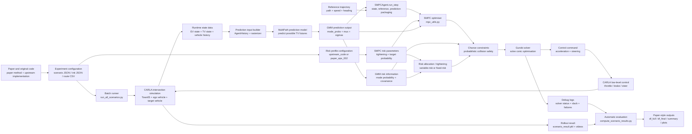

# End-to-End Explanation of the Experimental Code

This document explains the CARLA intersection reproduction code in the current `Research-Project-IMLS` repository from a high-level view down to implementation details. It is intended to clarify what the experiment reproduces, what each module does, how configuration enters the simulation, how SMPC is called, how results are saved and evaluated, and which technical terms are associated with each module.

## 1. Overall Experimental Goal

The current experiment reproduces the CARLA intersection scenario from the paper `Predictive Control for Autonomous Driving With Uncertain, Multimodal Predictions`. The core task is to let an ego vehicle safely and smoothly pass through an intersection with a target vehicle, using an SMPC controller that considers multimodal future trajectory predictions of the target vehicle.

This experiment is not just a replay of a trajectory. It is a closed-loop control system:

1. CARLA creates the road, vehicles, sensors, and simulation environment.
2. At every simulation step, the system reads the states of the ego vehicle and the target vehicle.
3. The MultiPath/GMM model predicts multiple possible future trajectories for the target vehicle.
4. SMPC solves for the control action using the prediction, risk constraints, and reference trajectory.
5. The control output is converted into CARLA `throttle`, `brake`, and `steer` commands and applied to the ego vehicle.
6. The simulation continues until the ego vehicle completes the task or reaches the maximum number of steps.
7. The post-processing script converts rollout results into paper-style tables and figures.

Technical terms:

- **Ego Vehicle / EV**: The vehicle being controlled. In this experiment, it is the vehicle that needs to pass through the intersection.
- **Target Vehicle / TV**: Another road user or obstacle vehicle. The ego vehicle needs to predict and avoid it.
- **Closed-loop Control**: A control scheme where the controller re-solves the control problem at every simulation step using the latest state.
- **Open-loop Control**: A control scheme that does not explicitly use future state feedback. It is usually used as an ablation baseline.
- **Ablation Study**: An experiment that removes, fixes, or simplifies one component to test its contribution.
- **Reproduction Pipeline**: The complete experiment chain from configuration and execution to result saving and automatic evaluation.

## 1.1 Experiment Flowchart: Where Data, the Model, GMM, and SMPC Risk Parameters Are Used

The following flowchart summarises the full closed-loop experiment. It answers four key questions:

1. Where does the data come from?
2. Where is the prediction model used?
3. Where do the GMM mean, covariance, and mode probabilities enter the controller?
4. Where do the SMPC risk parameters affect the optimisation problem?



In one sentence, the figure means: **configuration files and CARLA generate the experiment data; MultiPath converts the target vehicle's future into a multimodal GMM prediction; SMPC puts the GMM and risk parameters into chance constraints to solve for safe control; finally, the trajectory and debug logs are automatically converted into paper-style metrics.**

| Module | Data / parameter source | Where it is used | Purpose |
|---|---|---|---|
| Scenario / init configuration | `scenario_01.json`, `ego_init_*.json`, `intersection_01.csv` | `run_all_scenarios.py`, `run_intersection_scenario.py` | Defines the map, vehicles, route, initial speed, policy, and experiment combinations |
| CARLA runtime data | EV/TV pose, speed, and history at every CARLA tick | `RunIntersectionScenario.run_scenario()` | Provides the real simulation state for each closed-loop control step |
| MultiPath model input | TV history, local rasterised environment, map context | `AgentHistory`, `SemBoxRasterizer`, `DeployMultiPath` | Generates multiple possible future trajectories for the target vehicle |
| GMM output | `mode_probs`, `mus`, `sigmas` | From `SMPCAgent.run_step()` to `mpc_utils.py` | Represents the target vehicle's future uncertainty and enters the SMPC collision-risk constraints |
| GMM risk-related quantities | Mode probabilities `mode_probs` and covariances `sigmas` | Chance constraint / risk allocation | Higher probability or larger covariance means SMPC should treat that future mode more cautiously |
| SMPC risk parameters | `--risk_profile upstream_code` or `paper_eps_002` | `_risk_profile_values()`, `SMPC_MMPreds`, `SMPC_MMPreds_OL` | Determines tightening and target probability, which control how conservative the safety boundary is |
| Reference trajectory | Route CSV, vehicle dynamics, `RefTrajGenerator` | `smpc_agent.py`, `mpc_utils.py` | Tells the ego vehicle which path and speed profile it should follow through the intersection |
| Optimisation result | Control output solved by Gurobi | `SMPC.solve()`, `SMPCAgent.run_step()` | Outputs acceleration and steering, then converts them into CARLA control commands |
| Debug / evaluation data | `smpc_debug_steps.jsonl`, `scenario_result.pkl` | `compute_scenario_results.py` | Generates completion, feasibility, solve time, TV distance, path deviation, and slack metrics |

Technical terms:

- **Data Source**: The origin of experiment data. In this project, it includes configuration files, CARLA simulation states, original paper/upstream parameters, and prediction model outputs.
- **Prediction Model**: The model that predicts future motion. Here it refers to MultiPath, which predicts future target-vehicle trajectories instead of directly controlling the ego vehicle.
- **GMM Output**: Gaussian mixture model output, including `mode_probs`, `mus`, and `sigmas`. It describes where the target vehicle may go and how uncertain that future is.
- **Chance Constraint**: A probabilistic constraint. It does not mean collision is absolutely impossible; instead, it requires the collision probability to stay below a given risk level.
- **Tightening**: A risk tightening coefficient. A larger value usually makes the safety boundary more conservative.
- **Risk Allocation**: The allocation of a total risk budget across time steps and prediction modes. Variable-risk SMPC allocates this budget adaptively, while fixed-risk SMPC uses a more fixed allocation rule.
- **Closed-loop Feedback**: The ego vehicle repeatedly reads the latest state, predicts again, and re-solves the SMPC problem at each step.

## 2. Code Layer Architecture

The current experimental code can be divided into seven layers:

| Layer | Main files / directories | Responsibility |
|---|---|---|
| Experiment entry layer | `run_all_scenarios.py`, `run_modern_reproduction.sh`, `run_full_reproduction.sh` | Parses command-line arguments, combines scenario/init/policy settings, and creates result directories |
| Scenario configuration layer | `core/scripts/carla/scenarios/*.json`, `scenarios/inits/*.json`, `intersection_01.csv` | Defines the map, vehicles, start/end points, initial speed, and visualisation parameters |
| CARLA simulation layer | `run_intersection_scenario.py` | Connects to CARLA, loads Town05, spawns vehicles, and advances synchronous simulation |
| Prediction layer | `AgentHistory`, `SemBoxRasterizer`, `DeployMultiPath` | Generates GMM multimodal predictions for the target vehicle from history states |
| Policy layer | `smpc_agent.py` | Reads state and prediction, manages the reference trajectory, calls the SMPC solver, and outputs control |
| Optimiser layer | `mpc_utils.py` | Implements reference generation, closed-loop SMPC, open-loop SMPC, risk constraints, and solver logic |
| Evaluation layer | `compute_scenario_results.py`, `evaluation/closed_loop_metrics.py` | Loads rollouts and generates `df_full.csv`, `df_final.csv`, `paper_metrics_summary.md`, and related outputs |

Technical terms:

- **Layered Architecture**: A software structure that separates the entry point, configuration, simulation, control, optimisation, and evaluation into different modules.
- **Batch Runner**: A script that automatically executes multiple experiment combinations.
- **Scenario Configuration**: The definition of the map, vehicles, and task in the simulation.
- **Policy**: The control logic that outputs an action given the current state.
- **Backend Solver**: The optimisation solver, such as Gurobi or IPOPT, used to solve the control problem.

## 3. High-Level Execution Chain

A typical command is:

```bash
cd core/scripts/carla

python run_all_scenarios.py \
  --scenario_glob "scenario_01.json" \
  --init_glob "ego_init_0[1-5].json" \
  --policies smpc_var_risk smpc_open_loop smpc_fixed_risk \
  --solver_backend gurobi \
  --risk_profile upstream_code \
  --with_notv \
  --with_notv_cl \
  --enable_camera_viz
```

The execution order is:

1. `run_all_scenarios.py` finds `scenario_01.json`.
2. It finds `ego_init_01.json` to `ego_init_05.json`.
3. For each `scenario × init` combination, it runs:
   - `notv`
   - `notv_cl`
   - `smpc_var_risk`
   - `smpc_open_loop`
   - `smpc_fixed_risk`
4. Each sub-experiment calls `RunIntersectionScenario.run_scenario()`.
5. Each sub-experiment writes to a directory such as:
   - `core/results/20260524_133505/scenario_01_ego_init_02_smpc_var_risk/`
6. After the batch finishes, `compute_scenario_results.py` is automatically called for post-processing.

Technical terms:

- **Scenario Grid**: The experiment grid formed by `scenario × initial condition × policy`.
- **Initial Condition**: The starting state of a rollout, such as the initial speed and longitudinal offset of the ego vehicle.
- **Rollout**: One complete simulation trajectory from the initial state until completion or failure.
- **Timestamped Results Directory**: A result folder named with a timestamp to separate outputs from different experiment runs.

## 4. Experiment Entry Layer: `run_all_scenarios.py`

`core/scripts/carla/run_all_scenarios.py` is the most important batch experiment entry point.

It mainly does five things:

1. Parses command-line arguments.
2. Matches scenario JSON files and ego init JSON files.
3. Creates a sub-result directory for each policy.
4. Calls `run_with_tvs()` or `run_without_tvs()` to execute simulation.
5. Writes the batch summary and triggers post-processing.

Key parameters:

| Parameter | Meaning |
|---|---|
| `--scenario_glob` | Matches scenario files, such as `scenario_01.json` |
| `--init_glob` | Matches ego initial condition files, such as `ego_init_0[1-5].json` |
| `--policies` | List of control policies to test |
| `--solver_backend` | SMPC solver backend. The main experiment uses `gurobi` |
| `--risk_profile` | Risk-constraint profile. The current common choice is `upstream_code` |
| `--with_notv` | Additionally runs the no-target-vehicle baseline |
| `--with_notv_cl` | Additionally runs the no-target-vehicle closed-loop/centerline baseline |
| `--enable_camera_viz` | Enables CARLA camera visualisation and saves AVI videos |
| `--skip_postprocess` | Skips automatic metric generation |

Policy mapping in `run_all_scenarios.py`:

| Policy name | Experimental meaning |
|---|---|
| `notv` | No-target-vehicle baseline, used to check whether the basic route can be completed |
| `notv_cl` | No-target-vehicle closed-loop/centerline baseline, used as a trajectory reference and comparison |
| `smpc_var_risk` | Variable-risk SMPC, corresponding to the direction of the paper's proposed method |
| `smpc_fixed_risk` | Fixed-risk SMPC, an ablation of variable-risk SMPC |
| `smpc_open_loop` | Open-loop SMPC ablation, used to compare the effect of feedback structure |

Technical terms:

- **Policy Sweep**: Testing multiple control policies sequentially under the same scenario.
- **Baseline**: A reference method used to judge whether the main method brings improvement.
- **Risk Profile**: The risk configuration profile that determines the tightening level of the chance constraint.
- **Post-processing**: The process of converting raw simulation trajectories into metrics, tables, and figures.

## 5. Scenario Configuration Layer

The main scenario configuration files are:

- `core/scripts/carla/scenarios/scenario_01.json`
- `core/scripts/carla/scenarios/intersection_01.csv`
- `core/scripts/carla/scenarios/inits/ego_init_*.json`

### 5.1 Scenario JSON

`scenario_01.json` defines:

1. The CARLA map, such as `Town05`.
2. Weather, FPS, and the intersection CSV.
3. Visualisation camera parameters.
4. The ego vehicle, target vehicle, and static vehicle.
5. The model, colour, start/end nodes, speed, and policy for each vehicle.

The most important part is `vehicle_params`. It defines:

- Which vehicle is the ego vehicle.
- Which vehicle is the target vehicle.
- Which vehicles are static obstacles.
- Which intersection node each vehicle starts from and ends at.
- The lateral and longitudinal offsets of start and end points.
- `nominal_speed` and `init_speed`.
- MPC/SMPC parameters such as horizon `N`, time step `dt`, and number of modes.

### 5.2 Init JSON

Files such as `scenarios/inits/ego_init_01.json` usually override only a few ego initial parameters:

- `start_longitudinal_offset`
- `init_speed`

This allows the same scenario to be tested repeatedly under different ego initial speeds and starting offsets.

### 5.3 Intersection CSV

`intersection_01.csv` defines the intersection geometry. The code uses the intersection nodes in this CSV to generate paths, start/end points, and reference trajectories.

Technical terms:

- **Map**: A CARLA map, such as `Town05`.
- **Waypoint**: A reference point on the road.
- **Route**: The road path that the vehicle needs to follow.
- **Longitudinal Offset**: Offset along the forward direction of the road.
- **Lateral Offset**: Offset to the left or right of the lane centreline.
- **Nominal Speed**: The desired cruising speed.
- **Static Obstacle**: A stationary obstacle that is not dynamically predicted.

## 6. CARLA Simulation Layer: `run_intersection_scenario.py`

`core/scripts/carla/scenarios/run_intersection_scenario.py` is responsible for connecting to CARLA and running a single rollout.

### 6.1 Initialisation Process

`RunIntersectionScenario.__init__()` roughly does the following:

1. Saves parameters.
2. Connects to the CARLA client.
3. Loads the `Town05` map.
4. Sets synchronous simulation mode.
5. Spawns the ego, target, and static vehicles.
6. Binds a policy to the ego vehicle.
7. Initialises the prediction model and visualisation modules.

### 6.2 Main Simulation Loop

`run_scenario()` is the main loop of a single experiment. Each step roughly does the following:

1. Advances CARLA with `world.tick()`.
2. Reads the state of each actor.
3. Updates the target vehicle's historical trajectory.
4. Calls MultiPath to predict the target vehicle's future trajectory.
5. Constructs `pred_dict`.
6. Calls the ego policy's `run_step(pred_dict)`.
7. Applies the policy output to the vehicle.
8. Records state, control, feasibility, and solve time.
9. Checks whether the task is completed.
10. Saves `scenario_result.pkl` after the simulation ends.

Technical terms:

- **Synchronous Simulation**: A simulation mode where every step is advanced explicitly with a tick, ensuring alignment between control and simulation time.
- **Actor**: An entity in CARLA, such as a vehicle or sensor.
- **VehicleControl**: CARLA's low-level control object, including `throttle`, `brake`, and `steer`.
- **Tick**: One discrete simulation time step.
- **State Logging**: Recording states for post-processing and analysis.

## 7. Prediction Layer: MultiPath/GMM Prediction

The current prediction chain is mainly completed around `RunIntersectionScenario._make_predictions()`.

Main components:

| Component | Role |
|---|---|
| `AgentHistory` | Stores historical target-vehicle states |
| `SemBoxRasterizer` | Converts the local traffic environment into rasterised model input |
| `DeployMultiPath` | Loads the MultiPath model and outputs future trajectory distributions |
| `mode_probs` | Probability of each prediction mode |
| `mus` | Position mean of each mode at each future time step |
| `sigmas` | Covariance of each mode at each future time step |

MultiPath outputs multimodal predictions in GMM form:

- The vehicle may go straight.
- The vehicle may slightly shift laterally.
- The vehicle may follow different speed or trajectory changes.

SMPC does not assume the target vehicle has only one deterministic future trajectory. Instead, it includes multiple possible futures in the risk constraints.

Technical terms:

- **Multimodal Prediction**: A prediction that represents several reasonable future trajectories.
- **Gaussian Mixture Model / GMM**: A model that represents uncertain futures using multiple Gaussian distributions.
- **Mode Probability**: The probability that each prediction mode will occur.
- **Mean Trajectory**: The mean trajectory of a prediction mode.
- **Covariance Matrix**: A matrix describing the shape and size of uncertainty around the predicted position.
- **Rasterization**: Encoding maps and vehicle history into an image/tensor input.

## 8. Policy Layer: `smpc_agent.py`

`core/scripts/carla/policies/smpc_agent.py` is the ego vehicle's control policy layer. It connects the CARLA simulation to the SMPC optimiser.

### 8.1 `SMPCAgent.__init__()`

During initialisation, it:

1. Reads vehicle parameters.
2. Sets the horizon, `dt`, and number of modes.
3. Determines the policy type:
   - variable-risk
   - fixed-risk
   - open-loop
   - OBCA variant
4. Initialises `RefTrajGenerator`.
5. Initialises the SMPC solver.
6. Initialises debug output state.

### 8.2 `SMPCAgent.run_step()`

This is the main function called at every simulation step.

Execution order:

1. Reads the current ego state from CARLA.
2. Converts the coordinate system.
3. Projects the ego state into the Frenet frame.
4. Checks whether the task is completed.
5. Generates or restores the reference trajectory.
6. Processes the target vehicle prediction.
7. Constructs `update_dict`.
8. Calls `update()` of the SMPC object.
9. Calls `solve()` of the SMPC object.
10. Converts the optimised control into CARLA control.
11. Writes debug JSONL logs.

### 8.3 `update_dict`

`update_dict` is the most important data interface between the policy layer and the optimiser layer. It contains:

- Ego initial errors: `dx0`, `dy0`, `dpsi0`, `dv0`
- Reference state: `x_ref`, `y_ref`, `psi_ref`, `v_ref`
- Reference input: `a_ref`, `df_ref`
- Linearisation trajectory: `x_lin`, `y_lin`, `psi_lin`, `v_lin`
- Current target vehicle state: `x_tv0`, `y_tv0`
- Target vehicle GMM: `mus`, `sigmas`, `probs`
- Previous control: `u_prev`
- Vehicle shape matrices: `tv_shapes`

Technical terms:

- **Frenet Frame**: A coordinate frame built along the reference path. It commonly uses `s` for distance along the path, `ey` for lateral error, and `epsi` for heading error.
- **Reference Trajectory**: The trajectory that the controller wants the ego vehicle to track.
- **Linearization Trajectory**: A trajectory used to approximate nonlinear vehicle dynamics as a linear time-varying model.
- **Control Input**: The command variables, usually acceleration `a` and front wheel steering angle `df`.
- **Low-level Control**: The conversion from high-level acceleration/steering commands to `throttle`, `brake`, and `steer`.

## 9. SMPC Optimisation Layer: `mpc_utils.py`

`core/scripts/carla/utils/mpc_utils.py` is the most important mathematical optimisation file in the experiment.

### 9.1 `RefTrajGenerator`

`RefTrajGenerator` generates a dynamically feasible reference trajectory. It considers:

- Vehicle dynamics.
- Speed lower and upper bounds.
- Acceleration and steering bounds.
- Input rate constraints.
- Waypoint tracking cost.

Its role is not obstacle avoidance. Instead, it provides SMPC with a reasonable, smooth, and trackable reference.

Technical terms:

- **Feasible Reference**: A reference trajectory that satisfies vehicle dynamics and input constraints.
- **Input Rate Constraint**: A constraint that limits how quickly acceleration and steering can change.
- **Tracking Cost**: A cost term that penalises deviation from the reference trajectory.

### 9.2 `SMPC_MMPreds`

`SMPC_MMPreds` is the main implementation of closed-loop risk-aware SMPC.

It handles:

1. EV linear time-varying dynamics.
2. TV multimodal prediction.
3. Chance constraints.
4. Risk allocation.
5. Collision avoidance.
6. Input and state constraints.
7. Gurobi conic optimisation.

Main methods:

| Method | Role |
|---|---|
| `_get_LTV_EV_dynamics()` | Constructs the linear time-varying dynamics matrices for the ego vehicle |
| `_set_TV_ref()` | Converts the target vehicle GMM into optimiser parameters |
| `_add_constraints_and_cost()` | Adds constraints and objective terms |
| `update()` | Writes the latest state, prediction, and reference at every step |
| `solve()` | Calls Gurobi to solve for the control input |

### 9.3 `SMPC_MMPreds_OL`

`SMPC_MMPreds_OL` is the open-loop ablation. Its purpose is to test how the system behaves without the closed-loop feedback structure.

In the current version, the open-loop controller includes engineering stabilisation:

- It uses `risk_profile=upstream_code` to align with the upstream risk profile.
- It uses `collision_slack` to soften collision constraints and avoid immediate `INF_OR_UNBD` in boundary cases.
- Its fallback was changed from hard braking to reference input to avoid failure cascades.

This allows open-loop to complete the task, but it should not be interpreted as a fully hard-constraint success.

Technical terms:

- **Stochastic Model Predictive Control / SMPC**: Model predictive control that explicitly considers uncertainty in the optimisation problem.
- **Chance Constraint**: A probabilistic constraint requiring the collision risk to stay below a threshold.
- **Risk Allocation**: The distribution of the total risk budget across time steps, target vehicles, or prediction modes.
- **SOCP / Second-order Cone Programming**: A type of convex optimisation problem that can be solved by Gurobi.
- **Slack Variable**: A variable used to soften a constraint so that the problem can still be solved in boundary cases.
- **Fallback Control**: A backup control strategy used when the solver fails.

## 10. Risk Configuration and Reproduction Profile

The current code supports two risk profiles:

| Risk profile | Meaning | Tightening |
|---|---|---|
| `upstream_code` | Closer to the upstream CARLA code profile | `1.64` |
| `paper_eps_002` | Closer to the epsilon=0.02 statement in the paper text | approximately `2.054` |

The current main experiment uses:

```bash
--risk_profile upstream_code
```

This is because the actual upstream CARLA intersection code uses a tightening value closer to `1.64`. However, there is a profile mismatch between the paper text and the upstream code, so the final dissertation should clearly state which profile is used.

Technical terms:

- **Tightening**: A constraint-tightening coefficient used to convert a probabilistic constraint into a deterministic safety boundary.
- **Confidence Level**: The probability level at which the constraint is expected to hold.
- **Reproduction Fidelity**: The degree to which the current implementation matches the original paper or upstream code.

## 11. Completion Criterion and Reference Recovery

The current completion check does not only look at the CARLA goal. It records several quantities at the same time:

- `s_to_end`: Remaining distance to the end of the reference path.
- `goal_dist`: Distance to the CARLA goal coordinate.
- `ey`: Lateral error.
- `lateral_ok`: Whether lateral error is within the threshold.
- `completion_valid`: Whether the completion is valid.

This is necessary because the CARLA goal coordinate and the reference path end may not perfectly coincide. If only one metric is used, the system may report a false completion where the vehicle looks completed but is actually off-route.

Reference recovery is an important engineering protection in the current code:

- If lateral error is too large, the code no longer regenerates a new reference from the deviated vehicle state.
- It restores the global reference.
- It forces the use of a reference slice for linearisation.

Technical terms:

- **Completion Criterion**: The rule used to determine whether the task has been completed.
- **Goal Distance**: Euclidean distance from the current position to the target coordinate.
- **Path Progress**: Progress along the reference path.
- **Lateral Error**: The ego vehicle's side deviation from the reference path.
- **Reference Recovery**: A mechanism that prevents a deviated trajectory from being locked in as the new reference.

## 12. Debug Output Chain

Each SMPC sub-experiment directory usually contains:

| File | Meaning |
|---|---|
| `smpc_debug_setup.json` | Initialisation information, such as policy, risk profile, `N`, `dt`, and SMPC type |
| `smpc_debug_steps.jsonl` | Per-step control and solver debug records |
| `smpc_first_failure.json` | Full context of the first solver failure |
| `smpc_debug_latest_failure.json` | Context of the latest failure |
| `smpc_completion.json` | State and completion metrics at the first valid completion |

Each line in `smpc_debug_steps.jsonl` is a JSON object containing:

- vehicle state
- prediction summary
- reference status
- solver result
- applied control
- completion metrics
- relative geometry to the TV
- slack and solver failure information

Technical terms:

- **JSONL**: A log format where each line is one JSON object. It is convenient for incremental writing and streaming analysis.
- **Solver Status**: The optimisation solver status, such as `OPTIMAL`, `SUBOPTIMAL`, or `INF_OR_UNBD`.
- **Infeasible or Unbounded / INF_OR_UNBD**: A solver status indicating that the solver cannot determine whether the problem is infeasible or unbounded. It often indicates constraint conflict or numerical issues.
- **Diagnostic Logging**: Logging used to locate the cause of failure, rather than only saving the final result.

## 13. Result Evaluation Layer

The evaluation entry point is:

```bash
python core/scripts/compute_scenario_results.py \
  --results_dir core/results/<timestamp> \
  --compute_metrics
```

After a batch run finishes, `run_all_scenarios.py` automatically executes a similar command.

### 13.1 Output Files

| File | Meaning |
|---|---|
| `df_full.csv` | Full metrics, one row for each `scenario × initial × policy` |
| `df_norm.csv` | Adds metrics normalised relative to `notv` on top of `df_full` |
| `df_final.csv` | Aggregated mean table by `scenario × policy` |
| `paper_metrics_summary.csv` | Compact CSV summary for dissertation/reporting |
| `paper_metrics_summary.md` | Markdown summary for dissertation/reporting |
| `trajectory_map.png/svg` | XY trajectory plot |
| `paper_panel.png/svg` | Paper-style curve panel |

### 13.2 Core Metrics

| Metric | Meaning |
|---|---|
| `completion_time` | Time required to complete the task |
| `feasibility_percent` | Fraction of steps where the solver is feasible |
| `average_solve_time` | Average optimisation solve time per step |
| `dmin_TV` | Minimum distance from the ego vehicle to the target vehicle |
| `max_lateral_acceleration` | Maximum lateral acceleration |
| `avg_longitudinal_jerk` | Average longitudinal jerk |
| `avg_lateral_jerk` | Average lateral jerk |
| `hausdorff_dist_notv` | Path deviation relative to the no-TV baseline |
| `completion_valid` | Whether the task completion is valid |
| `solver_failure_frac` | Fraction of solver failures |
| `collision_slack_significant_frac` | Fraction of steps with significant collision slack in open-loop |
| `max_abs_ey_debug` | Maximum absolute lateral error from debug logs |
| `forced_reference_linearization_frac` | Fraction of forced reference linearisation steps |

Technical terms:

- **Feasibility Rate**: The fraction of optimisation problems that are solved successfully.
- **Solve Time**: The time spent solving the optimisation problem at each step.
- **Minimum Distance / dmin**: The minimum distance between the ego vehicle and the target vehicle, commonly used for safety analysis.
- **Lateral Acceleration**: Acceleration in the side direction, reflecting turning comfort and stability.
- **Jerk**: The rate of change of acceleration. Higher jerk indicates less smooth control.
- **Hausdorff Distance**: A distance measure between two trajectory point sets, used to quantify path deviation.

## 14. How to Interpret the Latest Experimental Results

Using `core/results/20260524_133505` as an example, the current experiment includes:

- 1 intersection scenario.
- 5 ego initial conditions.
- 5 policy types.
- 25 rollouts in total.

Current key findings:

- All rollouts completed the intersection task.
- `smpc_var_risk` and `smpc_fixed_risk` can complete the task under multiple initial conditions, showing that the main closed-loop SMPC pipeline is working.
- `smpc_open_loop` also completes the task, but it significantly relies on `collision_slack`, so it should be treated as a diagnostic ablation rather than a fully hard-constraint baseline.
- The path deviation of `smpc_var_risk/fixed_risk` is still relatively large, meaning reference tracking and linearisation still need improvement.
- `smpc_var_risk` has a small number of `INF_OR_UNBD` failures in some initial conditions, indicating that the variable-risk version still needs further stability improvement.

Technical terms:

- **Preliminary Results**: Early results that show the pipeline and direction are working, but should not yet be treated as final conclusions.
- **Pilot Experiment**: A small-scale experiment used to validate the method and identify problems.
- **Quantitative Agreement**: The degree to which current results numerically match the original paper.
- **Diagnostic Ablation**: An ablation used mainly to diagnose problems. It may not be fully equivalent to the final baseline in the paper.

## 15. Relationship Between the Current Implementation and the Original Paper

The experimental idea of the current code is consistent with the original paper:

- It reproduces the CARLA intersection scenario.
- It uses multimodal target-vehicle prediction.
- It uses SMPC to control the ego vehicle.
- It compares proposed variable-risk, fixed-risk, open-loop, and no-TV baselines.
- It generates metrics for completion, safety, comfort, solve time, and path deviation.

However, the current implementation is not yet a completely unbiased final reproduction:

- `collision_slack` was added to open-loop for stabilisation.
- Completion diagnostics are stricter than in the original code.
- Reference recovery was added as an engineering protection to prevent a deviated trajectory from becoming the new reference.
- The current experiment scale is still a small pilot.

Therefore, external reporting should use phrases such as:

- “reproduction-oriented implementation”
- “preliminary reproduction pipeline”
- “multi-initialisation pilot”

It should not directly claim:

- “fully reproduced the paper results”
- “quantitatively matched the original paper”

## 16. Module-Level Technical Terms Summary

| Module | Technical term | Explanation |
|---|---|---|
| Batch execution | Batch Experiment | Runs multiple scenario/init/policy combinations at once |
| Scenario configuration | Scenario | A full definition of simulation map, vehicles, route, and parameters |
| Initial condition | Initial Condition | The starting speed, position offset, and related setup of each rollout |
| CARLA simulation | Closed-loop Rollout | A complete trajectory generated by interaction between the controller and simulation environment |
| Prediction model | Multimodal Prediction | Predicts several possible future motions of the target vehicle |
| Prediction distribution | GMM | Represents future trajectory uncertainty using multiple Gaussian distributions |
| Coordinate conversion | Frenet Frame | A path-aligned coordinate frame defined along the reference route |
| Controller | SMPC | Stochastic model predictive control that considers uncertainty and constraints |
| Risk constraint | Chance Constraint | Limits collision risk in probabilistic form |
| Risk allocation | Risk Allocation | Allocates the total risk budget across time steps, modes, or target vehicles |
| Optimisation problem | SOCP | Second-order cone programming, solvable by Gurobi |
| Solver | Solver | Software used to solve the optimisation problem, such as Gurobi |
| Soft constraint | Slack Variable | Allows a small constraint violation through a slack variable |
| Post-processing | Post-processing | Converts raw trajectories into metrics, tables, and plots |
| Path deviation | Hausdorff Distance | Measures the maximum deviation between two trajectories |
| Comfort | Jerk | Rate of change of acceleration, used to measure control smoothness |

## 17. Future Code Optimisation Priorities

The most important optimisation directions are:

1. Reduce the path deviation of `smpc_var_risk/fixed_risk`.
2. Reduce `INF_OR_UNBD` solver failures in `smpc_var_risk`.
3. Separate hard-constraint open-loop from soft-constraint diagnostic open-loop.

Recommended next steps:

1. Tune tracking cost, heading cost, velocity cost, and input smoothness cost in a small range.
2. Continue recording and analysing `max_abs_ey_debug` and `forced_reference_linearization_frac`.
3. Keep the soft open-loop version, but also implement an original hard open-loop baseline.
4. After `scenario_01 + ego_init_01~05` becomes stable, extend to more initial conditions and more scenarios.

## 18. One-Sentence Summary

The current experimental code has formed a relatively complete CARLA intersection SMPC reproduction pipeline: `run_all_scenarios.py` handles batch experiments, `run_intersection_scenario.py` runs a single CARLA closed-loop simulation, `smpc_agent.py` converts states and predictions into an optimisation problem, `mpc_utils.py` solves the SMPC problem, and `compute_scenario_results.py` generates paper-style metrics. The current pipeline can already produce reportable preliminary results, but path deviation, solver stability, and the strict reproduction fidelity of the open-loop baseline still need further improvement.
