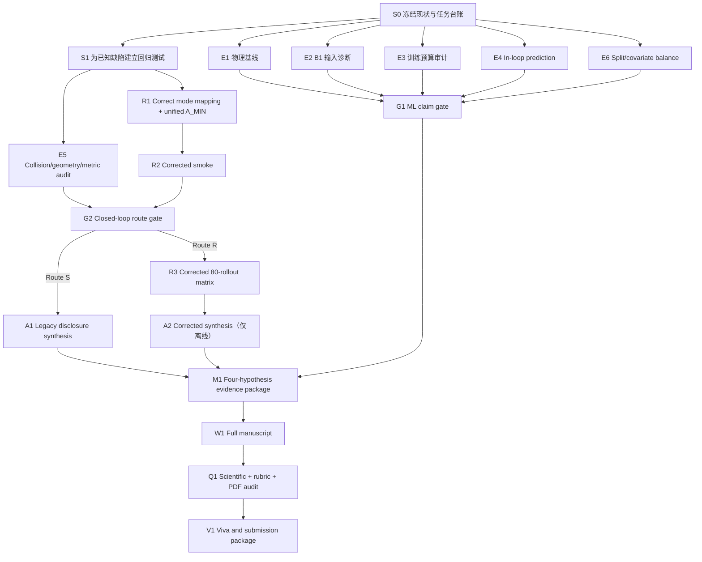

# Distinction research execution plan — completed research record

**版本：** v3（R3 complete / A2 corrected synthesis），2026-08-08
**适用范围：** 从 adversarial audit 完成后，到最终 TMLR-format dissertation、可复现实验资产和答辩材料全部完成  
**状态：** S0–M1 已完成；大规模 CARLA 已按预注册停止规则关闭
**当前唯一推进路线：** [`FINAL_TO_SUBMISSION_PLAN.md`](FINAL_TO_SUBMISSION_PLAN.md)
**说明：** 本文件保留为历史研究执行记录，不再用于开启 R4、改写假设或选择新实验
**配套审计：** [`DISTINCTION_READINESS_AUDIT_2026-08-08.md`](DISTINCTION_READINESS_AUDIT_2026-08-08.md)  
**进度记录：** [`DISTINCTION_PROGRESS_TRACKER.md`](DISTINCTION_PROGRESS_TRACKER.md)

---

## 0. 计划的唯一目标

最终成果不是“把已有结果写得像成功”，而是交付一个经得住严格 examiner 逐层追问的完整科研包：

1. 一个明确、聚焦、以机器学习为中心但不过度因果化的中心论点；
2. 四个定义稳定、证据边界清楚的核心假设；
3. 从 frozen data/model 到表图和正文数字均可追溯的证据链；
4. 对 physical baselines、model fairness、interaction tail、deployed calibration scope 和 closed-loop coupling 的完整、边界清楚的实验回答；
5. 对 mode mapping、policy-stack confounding、native collisions 和统计功效的透明处理；
6. 一份无 TODO、文献充分、TMLR 格式正确的英文 dissertation；
7. 一套 examiner 可访问的代码、配置、模型/数据说明、结果、图表、审计和复现指令；
8. 一份能回答最困难方法问题的 viva preparation package。

论文是否达到 distinction 最终由评阅人决定。本计划的目标是把所有可控的 scientific-validity 和 presentation 风险降到最低。

---

## 1. 冻结的研究定位

### 1.1 推荐标题

> **Task-Adapted Motion Prediction under Predictor–Risk Coupling: A Controlled CARLA Give-Way Study**

### 1.2 中心论点

> Under a frozen small-data give-way protocol, output-head task adaptation produced a large aggregate in-distribution prediction gain beyond simple physical baselines. The selected model was strongly raster-dependent but showed negligible aggregate sensitivity to shuffled target-history input. Lightweight Transformer residual adapters did not establish a consistent advantage over corresponding MLP residuals, and the comparison was not parameter matched. In deployment, aggregate predictor improvement coexisted with failure in the rare timing-shifted interaction-active tail and with policy-, behaviour- and timing-dependent control effects.

### 1.3 四个核心假设

| ID | 冻结形式 | 当前状态 |
| --- | --- | --- |
| H1 | B1 相对 frozen B0 和简单 physical/route-prior baselines 改善 held-out in-distribution give-way prediction | 强描述性支持；三种 physical baselines 均为 5/5 init 同方向 |
| H2 | 在两个匹配输出范围中，Transformer 替代容量近似匹配 MLP 会产生一致收益 | 未获支持 |
| H3 | B1 predictor-stack 的离线优势跨 policy/style/timing 稳定转化为闭环收益 | 未获一致支持；-3 m response-active ADE 明确反向 |
| H4 | 冻结 adaptive policy stack 支配三个预设 fixed policy stacks | 未获支持；排除 init50 后多个小效应翻转，纯 risk attribution 不成立 |

除非出现数据或代码错误，后续不增加第五个 headline hypothesis。Physical baselines、input ablations、active-tail analysis、collision sensitivity 和 calibration diagnostics 都是 mechanism/robustness analyses；未执行的 full calibration factorial 只列为 future work。

---

## 2. 不可违反的科研规则

1. 不使用已经打开的 test set 重新选择模型、训练轮数、阈值或 calibration。
2. 不因为结果“不好看”删除 rollout；任何排除必须由预先声明的数据质量规则触发，并删除完整配对 cluster。
3. 不把 window、simulation step 或 callback 当独立实验重复。
4. 不混合 legacy control implementation 与 corrected implementation 的结果。
5. 不把 post-hoc subgroup analysis 写成 confirmatory hypothesis test。
6. 不把三个 fixed settings 写成完整连续 frontier。
7. 不把 B1 与 T1/T2 写成 capacity-matched comparison。
8. 不把 zero observed collision 写成 zero collision risk 或 safety proof。
9. 不把 adaptive/fixed policy-stack effect 归因于单一 risk component，除非统一 A_MIN 后重跑。
10. 不声称首次发现 open-loop/closed-loop mismatch。
11. 不手工改 CSV/JSON 中的结果值；所有论文数字必须由脚本生成。
12. 所有 exploratory analyses 必须在文件名、表注和正文中标为 exploratory/post-hoc。
13. 所有失败结果保留日志和 provenance；不得覆盖或静默重跑。
14. 服务器密码、token 和个人凭证不得写入仓库、脚本、日志或论文。

---

## 3. 人机分工与合作方式

### 3.1 Codex 负责

- 阅读源代码、配置、原始结果和论文；
- 设计并实现分析/训练/CARLA runner；
- 使用 `apply_patch` 修改代码和文档；
- 本地运行 unit tests、static checks、data audits 和 LaTeX build；
- 生成 exact server commands、断点续跑逻辑和结果完成 marker；
- 在用户通知服务器完成后读取结果、复算统计、生成表图；
- 每完成一步更新 progress tracker、claim matrix 和论文；
- 在提交前做 adversarial review、citation audit、number audit 和 viva preparation。

### 3.2 用户负责

- 对会影响研究范围的分支选择作最终确认；
- 在 Codex 请求时允许 Git commit/push；
- 在云服务器执行 Codex 给出的完整命令，不自行修改参数；
- 服务器运行完成或失败时提供原始终端输出，或允许 Codex读取服务器结果；
- 提供学校的 deadline、字数/页数、学生姓名、导师姓名和提交系统要求；
- 最终确认论文中的个人陈述、acknowledgements 和 academic-integrity 内容。

用户不需要自己解释自动驾驶代码、选择统计检验或手工整理结果。遇到异常时停止运行并把完整错误交给 Codex，不自行“修到能跑”。

### 3.3 每一步的固定交付协议

Codex 每一步都必须给出：

1. 本步目的；
2. 修改的文件；
3. 本地验证结果；
4. 需要用户执行的唯一命令块；
5. 预期输出目录和 completion marker；
6. 正常进度查看命令；
7. 失败后安全续跑命令；
8. 通过/失败判定；
9. 对论文 claim 的影响；
10. tracker 更新。

用户每次只需要回答：命令是否执行、是否完成、是否报错，以及是否允许 commit/push。

---

## 4. 结果与目录规范

### 4.1 本地 canonical 输出

所有新增 evidence 统一放在：

```text
docs/paper/generated/distinction_v1/
├── 00_baseline/
├── 00_regression_gates/
├── 01_physical_baselines/
├── 02_input_ablations/
├── 03_training_budget/
├── 04_in_loop_prediction/
├── 05_collision_and_geometry/
├── 06_split_balance/
├── 07_ml_claim_gate/
├── 08_corrected_closed_loop/       # 仅在 Route R 使用
├── 09_evidence_manifest/
├── 10_paper_assets/
└── 11_final_audit/
```

### 4.2 服务器输出

所有新服务器运行统一写入：

```text
/root/autodl-tmp/results/give_way_transformer/distinction_v1/
```

不得把新结果散放在 `/root`、仓库根目录或旧 Day8–Day14 目录。每个 runner 必须支持：

- completed-arm detection；
- interrupted-arm restart；
- atomic per-arm marker；
- top-level completion JSON；
- stdout/stderr log；
- frozen contract、Git SHA、environment and artifact hashes；
- failed-arm manifest；
- dry-run/list-pending mode。

### 4.3 Legacy/new 隔离

- Day6–Day14 当前资产命名为 `legacy_evidence_v1`；
- corrected mode/A_MIN 的新运行命名为 `corrected_closed_loop_v1`；
- 两套结果可以并列讨论，但不能聚合、pool、续接 cluster count 或共用 confidence interval。

---

## 5. 依赖关系



---

## 6. Step-by-step task cards

## S0 — 建立 remediation baseline

**目标：**确保接下来所有变化都有明确起点，不覆盖现有用户改动。

**Codex：**

1. 审计当前 dirty worktree，将已有论文修改与本轮新计划区分；
2. 记录 HEAD、origin/main、关键 artifact hashes 和 offsite backup status；
3. 创建 `legacy_evidence_v1` provenance；
4. 将 C1–C9 转成机器/人工 acceptance checklist；
5. 经用户允许后提交一个只包含当前论文框架、审计和计划的 baseline commit。

**用户：**确认是否允许 commit/push；如服务器密码曾暴露，完成密码轮换。

**输出：**tracker baseline、Git SHA、legacy manifest。

**Gate S0：**工作区变更来源清楚，备份可读，所有后续任务均引用同一 baseline SHA。

---

## S1 — 先为缺陷写测试，再修改实现

**目标：**让已知问题不能再次静默出现。

**测试至少包括：**

1. `N_TV=1, K=3` 时 mode indices 必须为 0/1/2，而不是 0/0/0；
2. multi-TV joint-mode mapping；
3. fixed/adaptive reference bounds equality gate；
4. native collision event aggregation和 actor taxonomy；
5. `closed_loop_metrics.py` 全长度一致性；
6. result locator resolve + source value comparison；
7. Day9 deployment scope 只能声明 B0/B1；
8. legacy/corrected result directories 不得合并。

**Gate S1：**修复前关键 regression tests 能复现问题；修复后全部 PASS。不得通过放宽 assertion 消除失败。

---

## E1 — Frozen physical baselines

**研究问题：**B1 的大幅离线提升是否超过简单运动学或路线先验？

**实验组与对照：**

| 角色 | 方法 |
| --- | --- |
| Learned treatment | B1 frozen checkpoint |
| Pretrained control | B0 |
| Physical control 1 | Constant velocity |
| Physical control 2 | Constant acceleration |
| Route-prior control | Train-mean trajectory |

**控制规则：**

- 使用原 frozen train/validation/test split；
- baseline 参数只从 train 拟合；
- 不重新选择 B1；
- 相同坐标系、mask、full-horizon definition 和 2 s horizon；
- NLL baseline covariance 只用 train residuals 拟合；若模型假设不合理，NLL 放次要结果。

**指标：**

- primary：top-1 ADE、FDE；
- secondary：trajectory NLL、pointwise NLL；
- aggregation：flat-window、rollout macro、init macro；
- subsets：aggregate、assertive、reactive、response-active；
- paired evidence：五个 test init effects 和 direction count。

**输出：**JSON、CSV、五-init paired plot、baseline table、audit JSON。

**科学 gate，不以“必须赢”为通过条件：**

- 5/5 init 均优于 baseline：可写 strong sign-consistent descriptive advantage；
- 4/5：写 qualified advantage and heterogeneity；
- ≤3/5、差异很小或 B1 更差：撤回 learned-model superiority，改写为 narrow-route/domain-correction result。

**注意：**分析正确即通过；结果负向也必须保留。

---

## E2 — B1 frozen input diagnostics

**研究问题：**B1 是否利用 scene/state input，还是主要学习路线先验或输出分布修正？

**设计：**

- untouched B1 control；
- raster channel-mean replacement；
- rollout-consistent raster shuffle；
- past-state neutral replacement；
- rollout-consistent past-state shuffle；
- shuffle 使用多个冻结 seeds，并报告 mean/range。

**边界：**zero/replacement 可能是 OOD input，因此只作为 sensitivity diagnostic，不能声称 feature causality。

**输出：**aggregate/subgroup ADE/FDE/NLL、delta relative to untouched、five-init plots。

**Claim rule：**

- 明显退化：支持 B1 使用对应 input；
- 无明显退化：B1 的机制解释必须转向 route prior/output adaptation，并在 Discussion 中作为限制；
- assertive 与 active tail 方向不同：作为 subgroup mechanism，不新增 hypothesis。

---

## E3 — Training-budget and model-fairness audit

**研究问题：**Transformer 负向结果是否可能由 epoch cap、适配位置或 output freedom 造成？

**Codex：**

1. 汇总 15 条完整 train/validation histories；
2. 报告 last-epoch slope、best epoch、early-stop status、seed variance；
3. 生成 total/trainable parameters、input、output scope、residual limits、latency 表；
4. 检查 B2-M↔T1、B2-D↔T2 是否除 attention 外保持同一训练 contract。

**Longer-budget trigger：**若 matched pair 任一成员在 epoch 20 附近仍持续改善，运行 validation-only 50-epoch/patience sensitivity。不得重新打开 test 选 winner；原 Day8 仍为 primary。

**Claim rule：**

- 收敛且 matched effects 仍一正一负：H2 not supported 更稳固；
- Transformer 在 longer validation budget 改变排序：写 budget sensitivity，不能替换 frozen primary test；
- comparison contract 还有未控制差异：进一步收窄 architecture claim。

---

## E4 — Formal in-loop prediction analysis

**研究问题：**B1 的预测提升在部署状态分布中是否仍存在？是否集中在 inactive majority，并在 active tail 失效？

**输入：**Day10/Day11 160 rollouts 中的 labelled prediction JSONL 和 deployment manifests。

**分层：**

- predictor：B0/B1；
- risk policy；
- target style；
- offset：−3/0/+3 m；
- reactive active/inactive；
- horizon step。

**指标：**top-1 ADE/FDE、mixture NLL、top-mode ellipse coverage、sample/rollout/init counts。B1 同时报告 deployed calibration 和可验证恢复的 uncalibrated metrics。

**统计单位：**rollout macro 和 init-cluster summary。不同 predictors 诱导不同 trajectories，因此 B0/B1 对比是 deployed-distribution association，不是同一输入上的纯 model causal effect。

**标签：**aggregate analysis 为预先定义问题的追加分析；active subgroup 为 post-hoc exploratory mechanism。

**输出：**

- `in_loop_prediction_by_cell.csv`；
- `in_loop_prediction_by_init.csv`；
- `active_tail_diagnostics.csv`；
- aggregate-vs-active 主图；
- analysis audit 和 manuscript-ready caption。

**Gate E4：**每个数字能追溯到 rollout；counts 与原始日志一致；没有把 windows 当 independent n。

---

## E5 — Collision、geometry 和 control-metric audit

### E5.1 Native collision taxonomy

- 扫描所有 Day10/Day11 `scenario_run_summary.json`；
- callback→unique frame→contact episode；
- actor categories：ego–target、ego–infrastructure、target–infrastructure、other；
- footprint overlap 与 native collision 分开；
- 明确列出受影响 rollout。

### E5.2 Invalid-cluster sensitivity

对 Day11 target–traffic-light event：

- primary legacy report 保留原 observed result并标注问题；
- sensitivity 删除完整 init50 配对 cluster；
- 重新计算所有 H3/H4 effects；
- n=4 时明确最小双侧 exact p=0.125。

### E5.3 Fixed conflict geometry

- 从冻结地图/route 定义共同 conflict point/zone；
- 使用原 trajectories 重算 target clearance 和 adjusted delay；
- raw completion time 独立报告；
- 对比 old outcome-dependent 与 fixed-geometry metric。

### E5.4 Footprint sensitivity

- 核对 actual spawned blueprint；
- 使用真实 bounding-box dimensions；
- 对 inflation margin 做预设 sensitivity；
- 只称 observed geometric separation，不称 safety guarantee。

**Gate E5：**任何 collision 类型不再漏审；主要结论对合理几何定义的敏感性透明可见。

---

## E6 — Split and covariate-balance audit

**目标：**证明 40/5/5 init groups 没有重叠，并量化 train/validation/test 在 speed、offset、style、policy、active coverage 和有效 horizon 上的差异。

**输出：**

- init overlap gate；
- 4,036/506/495 usable-window 和 2,596/326/315 full-horizon count reconstruction；
- 每个 split 的 covariate balance table/plot；
- 任何 test distribution shift 的明确说明。

**Gate E6：**没有 ID/split leakage；counts 可从原始 manifests 重建。若发现重叠，立即停止论文结果冻结并升级为 critical data defect；不得事后重分后继续使用已打开 test。

---

## G1 — ML contribution gate

E1–E4 完成后，冻结最终 ML 叙事：

| 观察模式 | 最终 ML 定位 |
| --- | --- |
| B1 明显胜 B0 和全部 physical baselines；input ablation 退化 | 强 task-adaptation contribution，仍限 in-distribution |
| B1 胜 B0 但接近 CV/CA；input ablation 较弱 | domain/output correction + evaluation contribution |
| B1 aggregate 强，但 active tail 反转 | aggregate adaptation with interaction-tail failure；优先主叙事 |
| Transformer longer-budget 才改善 | budget-dependent negative result，不宣称 architecture inferiority |
| B1 不胜 physical baselines | 不把 learned predictor 作为性能贡献，改为 rigorous negative study |

G1 之后不再根据写作偏好改变模型结论。

---

## R1 — Corrected control implementation

该步骤只建立可选 Route R，不自动授权正式 CARLA 重跑。

**修改：**

1. single-TV 和 multi-TV 使用正确 joint-mode mapping；
2. fixed/adaptive reference generator 使用同一 frozen A_MIN；
3. 记录每步实际消费的 mode indices、mode means/covariance hashes；
4. native collision 加入 rollout hard audit；
5. 修复 length consistency check；
6. contract 写入 corrected implementation version，防止与 legacy 混合。

**本地 Gate R1：**unit tests 全部 PASS，legacy behaviour 只能通过显式 legacy flag 访问，不能是默认 formal profile。

---

## R2 — Corrected deployment smoke

**Pilot：**10 个、不进入正式统计的 rollouts：

- B0/B1 × fixed-medium/adaptive × assertive/reactive × 一个冻结 dev init，共 8 arms；
- B0/B1 × adaptive × reactive × offset −3 m × known-failure init50，共 2 个 collision regression probes。

**必须同时通过：**

- 10/10 completed；
- no non-finite prediction/control values；
- no native collision；
- K=3 时 modes 0/1/2 的 spatial means/covariances 均被消费；
- fixed/adaptive reference A_MIN hash/value 相同；
- model/calibration/config hashes 正确；
- solver/supervisor telemetry 完整；
- 运行时间在剩余服务器预算内可接受。

任何一项失败都先修复和重跑 smoke，不得直接进入 formal matrix。

---

## G2 — Closed-loop route decision

### Route S：transparent legacy study

选择条件：

- 剩余稳定服务器时间不足；或
- corrected smoke 无法在两轮修复内稳定；或
- 80-rollout 预计无法在提交缓冲前完成。

论文处理：

- Day10/11 明确标记 legacy top-mode spatial interface；
- adaptive/fixed 称 policy-stack comparison；
- H3/H4 仅作 tested-system evidence；
- timing 作为 descriptive robustness；
- collision、fixed geometry 和 complete-case sensitivity 必须完成。

### Route R：corrected prospective core

选择条件：

- Gate R2 完整通过；
- 至少保留 3–4 天稳定计算窗口和 2 天写作/审计缓冲；
- 用户确认运行 80-rollout 成本。

决策一旦写入 tracker，不因中途结果方向改变。

---

## R3 — Corrected 80-rollout nominal matrix

| Factor | Levels |
| --- | --- |
| Predictor stack | B0 identity, B1 frozen calibration |
| Risk policy | fixed-aggressive, fixed-medium, fixed-conservative, adaptive |
| Target style | assertive, reactive |
| Init | 优先 5 个新生成并在运行前冻结的 in-distribution groups；fallback 为 46–50 |
| Total | 80 rollouts |

**设计改进：**

- 生成 deterministic block-randomised run order，避免始终 B1→B0；
- init 内保持完整 treatment block；
- pilot/dev init 不得进入正式 80；
- 若使用新 init groups，generation rule、参数范围和 IDs 必须在看结果前冻结；
- 若只能复用 46–50，结果称 corrected technical replication/sensitivity，不称独立 confirmatory sample；
- 所有 thresholds/configs 在首个 formal rollout 前 freeze；
- corrected results 使用新目录和新 schema；
- failure rerun 只允许按预设 infrastructure rule，保留第一次失败记录；
- primary analysis 使用五个 init paired clusters；
- timing shifts 不自动重跑，旧 timing 只作 legacy exploratory evidence。

**Primary outcomes：**ego route-completion duration（`smpc_completion.step / 20 Hz`，越低越好）与实际 CARLA bounding-box 的 minimum footprint separation（每车 0.25 m margin，越高越好）。Native collision、footprint collision、fixed-geometry yield failure 与 completion failure 是 rollout-level ITT failure guards。Target-exit elapsed time、post-clearance completion lag 与 fixed-geometry yield gap 只作 secondary decomposition；不得把 treatment-responsive target exit 当作主效率指标的调整项。

**Mechanisms：**solver failure, supervisor activity, mode/risk allocation telemetry。

**执行与恢复 hardening：**

- 使用全新的 `r3_corrected_formal_v3` 目录和 protocol；不得混入 v1 partial output 或只完成 preflight 的 v2 目录；
- 每个 treatment–init rollout 写入独立 attempt 目录，只有 raw JSON/JSONL/pickle/CSV 完整可解析后才原子提升为 canonical rollout；
- receipt 同时绑定 raw-evidence hash、accepted attempt record、immutable attempt ledger 与关键文件 hashes；
- 最多 10 次、只对 allowlisted infrastructure failure 自动续跑；unknown failure 必须停下审计；
- collision、yield/completion failure、runtime exceedance、zero reactive activity、adaptive 无 variation、mode collapse、null/negative effects 都是科学结果，不得触发重跑；
- native collision 使用 canonical unordered actor-ID pair，将 mirrored callback 与连续 frame 合并为 contact episode；callback/episode 均不增加独立样本数；
- footprint replay 使用实际 spawned actor bbox、local centre 与 local yaw，并预冻结 0/0.25/0.35/0.50 m 四个 margins；
- 先写 analysis/stop gate，再写 data marker，再生成逐文件 hash 的可复算 archive，最后才原子写 `R3_COMPLETE.json`。

**Gate R3：**80/80 unique treatment keys 均通过 integrity audit；每个 outcome 必须已观测或因预先规定的科学原因被明确分类为 undefined/censored；native collision taxonomy、actual geometry、risk solver identity、control variables、receipt/raw hashes 与 provenance 完整；formal tables 行数和 hashes 通过；archive 逐成员回读通过。科学失败导致 primary continuous outcome 非 finite 时，不构成 integrity failure，也不要求增加 CARLA 样本。

**R3 后的冻结停止规则：**只要 `R3_COMPLETE.json.status=pass`、`additional_large_scale_carla_required=false`，本课题的大规模 CARLA 数据采集即关闭。H3/H4 无论 positive、negative、null、mixed 或 adverse，均直接进入离线证据整理和论文写作；不得为追求更好方向追加 timing、seed、margin、policy 或 model runs。若 marker 未生成，只允许修复完整性缺陷并续跑同一 R3 key，不得启动新实验设计。

---

## R4 — Calibration factorial（冻结为 `not_run`）

R4 不再属于 dissertation 的必需实验。当前 H3 的 estimand 明确是 **deployed predictor-stack effect**（B1 weights + frozen validation calibration 相对 B0 identity stack），而不是 model-weight-only causal effect。论文必须按这一边界措辞，不能把 stack effect 单独归因于权重或 Transformer。完整 calibration factorial 会回答一个不同、更窄的机制分解问题，但不影响四个核心假设的可判定性，也不值得在提交前重新开启大规模 CARLA。

因此，R3 integrity-valid 完成后 R4 保持 `not_run`。未来工作可以在独立、预注册且参数匹配的研究中执行 B0/B1 × identity/calibrated factorial；不得把它描述为本论文遗漏的必要对照。

---

## M0 — Statistical analysis contract

所有新增分析在读取对应 outcome table 前先写入并 hash 一个 analysis contract。R3 使用保留原始 M0、不覆盖地追加的 `M0_R3_ANALYSIS_CONTRACT_v2`；v2 在任何 R3 outcome 被读取前冻结主 estimand、删失规则、collision episode、footprint margins、multiplicity families、bootstrap seed 和停止规则。

### M0.1 Independent unit and summaries

- independent unit：ego initialisation group；
- paired effect：同一 init 下 treatment minus control；
- primary display：所有 raw init effects + arithmetic mean；
- exact inference：two-sided sign-flip test；
- uncertainty：cluster bootstrap 只标为 descriptive；
- flat windows/steps 只用于 metric calculation，绝不作为 n；
- n=5 最小非零双侧 exact p=0.0625；complete-case n=4 时为 0.125。

### M0.2 Hypothesis families

| Hypothesis | Primary evidence | Secondary/exploratory | Multiplicity treatment |
| --- | --- | --- | --- |
| H1 | B1−B0 rollout/init-macro trajectory NLL；方向一致性 | ADE/FDE、physical baseline contrasts、subgroups | NLL 单独 primary；ADE/FDE 明确 secondary |
| H2 | T1−B2-M 与 T2−B2-D test macro NLL | latency、ADE/FDE、longer-budget validation sensitivity | 两个 matched NLL contrasts 为一组；Holm 报告但不以 p<.05 作唯一 verdict |
| H3 | Predictor-stack paired effects across pre-specified policy/style cells | timing、active/inactive、solver/supervisor mechanism | corrected run 前冻结 primary cells/outcomes；legacy evidence 全部 descriptive |
| H4 | Empirical two-outcome dominance against each of three fixed comparators | alternative margins、styles、predictors | 主要是逻辑/Pareto criterion；exact p 分别报告，不把“不显著”当 equivalence |

### M0.3 Required reporting fields

每个 contrast 必须报告：estimand、treatment/control、direction convention、n clusters、每个 raw cluster effect、mean/median、descriptive interval、exact p、Holm p（若属于 family）、missing/excluded clusters 和 confirmatory/descriptive/exploratory label。

### M0.4 Claim rules

- 不能用 `p>0.05` 声称 two methods equivalent；
- 不能因 bootstrap interval 不跨零而忽略 exact/Holm 结果；
- 不能用 aggregate result 覆盖相反的 target-style/active-tail pattern；
- 不能在看结果后改变 primary outcome、direction 或 multiplicity family；
- corrected run 如果使用新 init，可称 prospective corrected evaluation；复用 46–50 只能称 technical replication/sensitivity；
- negative/null/mixed result 与 positive result 使用相同报告篇幅和审计标准。

---

## M1 — 四假设 evidence package

**目标：**替换旧 H1–H8 和无效 locators。

每个 result record 必须包含：

- stable result ID；
- hypothesis/mechanism role；
- source file + SHA256；
- 可执行 JSON/CSV locator；
- extracted value、type、unit；
- aggregation unit；
- sample/rollout/init counts；
- primary/secondary/exploratory status；
- legacy/corrected implementation tag；
- table/figure consumers。

Audit 必须真正：

1. resolve locator；
2. 从 source 重取 value；
3. 检查数值容差和单位；
4. 检查 claims 只引用允许的 evidence role；
5. 检查 figure/table 与 source 一致；
6. 检查所有排除和缺失；
7. 检查 H1–H4 名称在论文、CSV、图表完全一致。

**Gate M1：**0 invalid locator、0 value mismatch、0 orphan headline claim、0 legacy/corrected pooling。

---

## W1 — Full manuscript pipeline

写作与实验并行，但按以下顺序锁定。

在学校正式 word/page limit 尚未确认前，使用约 10,000 英文词的工作预算；确认后按比例调整：

| Section | Working target |
| --- | ---: |
| Abstract | 200–250 |
| Introduction | 900–1,100 |
| Related Work | 1,600–1,900 |
| Problem Formulation | 500–700 |
| Methodology | 1,500–1,700 |
| Experimental Setup | 900–1,100 |
| Results | 1,700–1,900 |
| Discussion | 1,400–1,600 |
| Conclusion | 300–450 |

全稿目标为 30–35 篇核实文献、40–60 次有论证作用的正文引用、5–6 张核心图和 6–7 张核心表；完整 cells 和 sensitivities 移入 appendix。

### W1.1 Related Work

**目标：**约 1,500–2,000 英文词、25–35 篇 primary references、两个 comparison tables。

顺序：

1. multimodal prediction and task adaptation；
2. interaction/Transformer predictors and capacity/data requirements；
3. calibration and task-relevant prediction evaluation；
4. risk-aware planning and prediction–planning coupling；
5. synthesis：已有工作做了什么、本文只增加什么。

必须直接讨论 Bouzidi et al. 2025，不能把一般 open/closed-loop mismatch 当 novelty。

### W1.2 Methods

在结果最终冻结前完成：scenario、data-generating policy、split、coordinate frame、models、parameters、loss、checkpoint selection、architecture selection、calibration、deployment stack、SMPC interface、statistics、collision taxonomy、artifact provenance。

每个方法段达到“另一个学生仅凭论文和 artifact 可以复现”的程度。

### W1.3 Results

严格按 H1→H4：

1. 先 counts/integrity；
2. point estimate；
3. five-init direction/effect；
4. uncertainty/exact p；
5. hypothesis verdict；
6. boundary；
7. mechanism/robustness 另段报告。

Results 不写原因，不使用“proved/refuted”。

### W1.4 Discussion

围绕三个层次：

1. 与已有 literature 一致的部分；
2. 本文增加的受控机制证据；
3. 当前设计无法回答的问题。

必须讨论 physical baseline、B1/T fairness、active-tail scarcity、global calibration、top-mode interface、A_MIN/policy stack、n=5、single map 和 data-generating policy。

### W1.5 Abstract/Introduction/Conclusion

最后重写。Abstract 每个数字和 claim 都必须能映射到 M1 result ID。Conclusion 按 RQ1–RQ4 回答，不出现新数字。

### W1.6 Daily claim-language scan

每天扫描 `first`、`prove`、`universally`、`safe`、`significant`、`robust`、`complete frontier`、`Transformer is ineffective`、`calibration caused` 和 `supervisor caused`。这些词不一定绝对禁止，但每次出现都必须有直接证据、清楚 scope 和人工复核。

---

## Q1 — Distinction-level final audit

### Scientific validity gate

- 四假设与证据完全一致；
- H1 physical baseline 已回答；
- H2 只使用 matched residual pairs 作 architecture attribution；
- H3 区分 aggregate、active tail 和 predictor-stack treatment；
- H4 区分 policy-stack observation 与 risk-allocation causality；
- native collision、fixed geometry、legacy mode mapping 全部披露或被 corrected evidence 替代；
- n=5 没有被伪装成 large-sample significance。

### Literature/novelty gate

- 25–35 篇经核对 primary sources；
- 每个 research gap 有引用和 critical synthesis；
- 与最直接先行工作的相同/不同清楚；
- 无 `first`, `universal`, `proves safety` 等无依据表述。

### Reproducibility gate

- 从 clean checkout 可运行 analysis tests；
- 所有新 scripts 有 `--help`、输入检查和完成 marker；
- config、Git SHA、model/data hashes 和 environment 记录完整；
- examiner 可访问大资产，或有明确 availability/restriction statement；
- 论文全部数字通过 value-resolving audit。

### Manuscript/PDF gate

- 0 TODO、0 placeholder、0 missing reference/figure；
- TMLR format 编译无 error；
- 图中文字在最终页面尺寸可读；
- 表格单位、方向、n 和 primary/exploratory 标签完整；
- abstract、introduction、results、discussion、conclusion 的术语一致；
- rubric 每个 distinction descriptor 有对应章节证据。

---

## V1 — Viva and submission package

最终生成：

1. 2 分钟、5 分钟和 10 分钟口头版本；
2. 20 个最困难 examiner questions；
3. 每个 critical limitation 的透明回答；
4. 一页 contributions/limitations sheet；
5. 一页 experiment matrix and sample-size sheet；
6. 一页 result-number provenance sheet；
7. final PDF、source archive、artifact manifest 和 reproduction README。

---

## 7. 两周 critical-path 日程

这是工作日顺序，不要求服务器连续在线。写作 lane 与实验 lane 并行。

| 工作日 | 实验/代码 lane | 写作/证据 lane | 当日 gate |
| --- | --- | --- | --- |
| 1 | S0 baseline；S1 failing tests | 冻结 title、thesis、H1–H4 | baseline SHA + tracker |
| 2 | E1 physical baselines | Related Work sources/table skeleton | baseline audit PASS |
| 3 | E2 input diagnostics；E3 curves；E6 split audit | Related Work first complete draft | ML diagnostics complete |
| 4 | E4 in-loop analysis | Methods：data/model/calibration | in-loop counts/audit PASS |
| 5 | E5 collision/geometry；R1 | Methods：closed loop/statistics | G1；R1 local tests PASS |
| 6 | R2 server smoke | Introduction/gap/contributions | G2 Route S/R frozen |
| 7 | Route R formal run；或 Route S synthesis | Offline Results | no manual retuning |
| 8 | Route R formal run/analysis；或 M1 | Closed-loop Results | formal completeness/M1 |
| 9 | M1 evidence package | Discussion + limitations | 0 invalid locators |
| 10 | 全部 tests/audits | Abstract/conclusion/appendices | full draft complete |
| 11 | buffer for failed run only | citation and number audit | scientific audit PASS |
| 12 | no new exploratory experiment | supervisor-ready PDF | rubric audit PASS |
| 13 | only blocker repair | viva package | clean build |
| 14 | submission buffer | final proofread/archive | submission-ready |

**时间保护规则：**工作日 10 后不启动新的 exploratory experiment；工作日 12 后只修 submission blocker，不修改研究问题或模型选择。

---

## 8. 最终 Definition of Done

只有以下全部为真，任务才算完成：

- [ ] physical baselines、input diagnostics、in-loop analysis、collision/geometry 和 split-balance audit 全部完成；
- [ ] Route S/R 的选择、理由和边界写入 tracker；
- [ ] 若 Route R，corrected 80-rollout matrix 完整；若 Route S，legacy limitations 完整披露；
- [ ] result manifest 能从 sources 自动重算全部 headline values；
- [ ] 四假设在所有文档中唯一且一致；
- [ ] references 达到广度和批判性要求；
- [ ] 英文论文无 TODO，并通过 scientific、rubric、citation、number 和 PDF audits；
- [ ] 数据/模型/代码 availability statement 可执行；
- [ ] viva package 完整；
- [ ] 最终 Git commit/tag 和提交 archive 可恢复；
- [ ] 用户能用自己的话准确解释 contribution、negative results 和 limitations。

---

## 9. 下一次操作

下一步只执行 **S0**。在 S0 完成前不修改控制代码、不重新训练模型、不启动 CARLA。

S0 的第一轮动作将是：

1. 区分当前工作区中已有论文修改和本次新增审计/计划；
2. 建立 `legacy_evidence_v1` manifest；
3. 生成 C1–C9 machine/action checklist；
4. 给出准备提交的精确文件范围；
5. 请求用户批准 baseline commit/push。

S0 通过后才进入 S1 和 E1。
