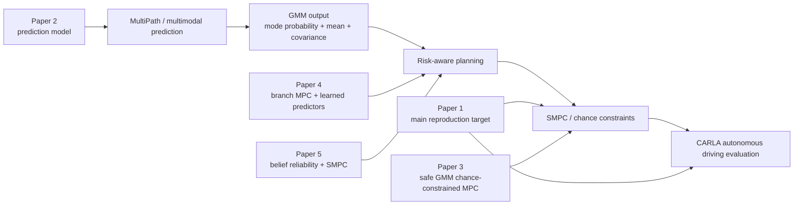

# 相关文献解读：SMPC、多模态预测与自动驾驶路口决策

本文档整理 5 篇与当前毕业设计方向高度相关的论文。当前项目的核心方向是：在 CARLA intersection 场景中，使用多模态目标车辆预测和风险感知 SMPC 控制 ego vehicle 安全、平滑地通过路口。因此，文献筛选重点围绕以下关键词：

- autonomous driving decision-making under uncertainty
- multimodal trajectory prediction
- Gaussian Mixture Model / GMM
- stochastic model predictive control / SMPC
- chance constraint
- risk allocation
- CARLA intersection evaluation

## 1. 文献列表

| 编号 | 论文 | 本地 PDF | 主要关联点 |
|---|---|---|---|
| 1 | Predictive Control for Autonomous Driving with Uncertain, Multi-modal Predictions | `01_predictive_control_uncertain_multimodal_predictions.pdf` | 当前项目直接复现对象 |
| 2 | MultiPath: Multiple Probabilistic Anchor Trajectory Hypotheses for Behavior Prediction | `02_multipath_behavior_prediction.pdf` | 解释 MultiPath/GMM 预测来源 |
| 3 | Safe Chance-constrained Model Predictive Control under Gaussian Mixture Model Uncertainty | `03_safe_chance_constrained_mpc_gmm_uncertainty.pdf` | GMM 不确定性下的 chance-constrained MPC |
| 4 | Motion Planning under Uncertainty: Integrating Learning-Based Multi-Modal Predictors into Branch Model Predictive Control | `04_branch_mpc_multimodal_predictors.pdf` | 学习型多模态预测与 MPC 结合 |
| 5 | Combining Belief Function Theory and Stochastic Model Predictive Control for Multi-Modal Uncertainty in Autonomous Driving | `05_belief_function_smpc_multimodal_uncertainty.pdf` | 不可靠模态概率下的 SMPC 风险调整 |

## 2. 总体关系图

一句话概括：**第 2 篇解释预测模型如何产生多模态 GMM，第 1 篇是你正在复现的核心 SMPC 方法，第 3/4/5 篇提供后续改进、对比和 dissertation discussion 的理论支撑。**

## 3. Paper 1: Predictive Control for Autonomous Driving with Uncertain, Multi-modal Predictions

本地文件：

`docs/literature/01_predictive_control_uncertain_multimodal_predictions.pdf`

### 这篇论文提出了什么

这篇论文是你当前实验的直接复现目标。它提出了一种用于自动驾驶路径规划的 Stochastic Model Predictive Control 方案，核心是把其它车辆的多模态预测结果纳入 SMPC 的碰撞避免约束中。

它的主要思想包括：

1. **多模态目标车辆预测**：目标车辆未来不是一条确定轨迹，而是多个可能模式，例如让行、继续前进、转弯或保持速度。
2. **GMM 表达预测不确定性**：每个未来模式包含概率、均值轨迹和协方差，用于表示目标车辆未来位置的不确定性。
3. **Chance-constrained collision avoidance**：碰撞约束不是完全硬约束，而是限制碰撞概率低于某个风险阈值。
4. **Variable risk allocation**：风险预算不是平均分配，而是根据不同预测模式和时间步进行优化分配。
5. **Feedback policy**：控制器不只是优化一串 open-loop 控制输入，而是优化能根据未来模式反馈调整的策略，从而降低保守性。

### 和你当前实验的关系

这篇论文对应你代码中的核心链路：

| 论文概念 | 你当前代码中的对应部分 |
|---|---|
| EV / TV | ego vehicle / target vehicle |
| Multimodal TV prediction | `mode_probs`, `mus`, `sigmas` |
| SMPC formulation | `core/scripts/carla/utils/mpc_utils.py` |
| Variable risk | `smpc_var_risk` |
| Fixed risk baseline | `smpc_fixed_risk` |
| Open-loop ablation | `smpc_open_loop` |
| CARLA intersection simulation | `run_intersection_scenario.py` |
| Paper-style metrics | `compute_scenario_results.py` |

### 对你有什么帮助

这篇论文对你最重要，因为它定义了你的毕业设计主线：

- 你可以把它作为 dissertation 的 **main reproduced paper**。
- 你的实验方法、policy 对照组、指标设计都应围绕它展开。
- 它提供了清晰的实验叙事：为什么单一预测不够，为什么要多模态预测，为什么要 risk-aware SMPC。
- 它也能支撑你现在 presentation 中的 hypothesis：
  - “If the car considers several possible futures and allocates risk properly, it should make safer and less conservative decisions.”

### 你可以在 dissertation 中怎么用

建议放在：

- Literature Review 的核心方法部分。
- Methodology 的复现目标说明。
- Experiment Design 的 policy comparison 说明。
- Discussion 中对比你的结果和论文结果的差距。

可写的关键句：

> This paper provides the main methodological basis for my reproduction work, as it formulates autonomous driving with uncertain multimodal predictions as a stochastic MPC problem with chance constraints and risk allocation.

### 对当前代码调试的启发

它提醒你重点关注：

- `smpc_var_risk` 是否真的比 fixed-risk 更安全或更少保守。
- `smpc_open_loop` 是否应作为严格 baseline，而不是加入过多工程 softening 后的版本。
- risk allocation、completion time、minimum TV distance、feasibility 和 solve time 是否接近论文报告维度。

## 4. Paper 2: MultiPath: Multiple Probabilistic Anchor Trajectory Hypotheses for Behavior Prediction

本地文件：

`docs/literature/02_multipath_behavior_prediction.pdf`

### 这篇论文提出了什么

MultiPath 是一个用于自动驾驶行为预测的多模态轨迹预测模型。它的核心思想是：未来轨迹不是直接从零生成，而是先定义一组 anchor trajectories，再让模型预测这些 anchor 的概率、偏移量和不确定性。

它主要提出：

1. **Anchor-based multimodal prediction**：用一组固定的未来轨迹 anchor 表示常见运动模式。
2. **Discrete mode probability**：模型输出每个 anchor/mode 的概率。
3. **Offset regression**：模型对 anchor 轨迹进行偏移修正，使预测更贴近当前场景。
4. **Uncertainty estimation**：对每个未来时间步输出不确定性，因此可形成 GMM。
5. **Efficient inference**：一次前向推理即可得到多个未来模式，比大量采样更高效。

### 和你当前实验的关系

你当前实验中的预测层本质上依赖类似 MultiPath 的输出形式：

| MultiPath 输出 | 你代码中的变量 | SMPC 中的用途 |
|---|---|---|
| mode probability | `mode_probs` / `probs` | 决定不同未来模式的风险权重 |
| mean trajectory | `mus` | 目标车辆未来中心位置 |
| covariance | `sigmas` | 目标车辆未来不确定性范围 |
| multimodal futures | GMM modes | 进入 collision chance constraints |

### 对你有什么帮助

这篇论文对你有三个重要作用：

1. **解释数据来源**：它说明 SMPC 不是凭空获得目标车未来轨迹，而是来自多模态预测模型。
2. **解释 GMM 含义**：你的 `mus/sigmas/probs` 可以通过 MultiPath 的输出逻辑讲清楚。
3. **支撑 SOTA 页面**：你可以说现有 prediction methods 已经能输出 several possible futures，但问题是 control 如何安全地利用这些 futures。

### 你可以在 presentation 中怎么讲

面向非专业老师可以这样说：

> MultiPath lets the car imagine several possible futures of another vehicle. It does not say there is only one future; instead, it gives several possible paths and how likely each one is.

更学术一点：

> MultiPath provides a compact probabilistic representation of future vehicle motion, which can be passed to a downstream planner as a Gaussian mixture model.

### 对当前代码调试的启发

这篇论文提醒你：

- 如果 `mode_probs` 不可靠，risk allocation 可能会被误导。
- 如果 `sigmas` 太大，SMPC 约束会变得更保守，可能导致 infeasibility。
- 如果只使用最高概率 mode，就会失去多模态预测的核心价值。

## 5. Paper 3: Safe Chance-constrained Model Predictive Control under Gaussian Mixture Model Uncertainty

本地文件：

`docs/literature/03_safe_chance_constrained_mpc_gmm_uncertainty.pdf`

### 这篇论文提出了什么

这篇论文研究在 GMM 不确定性下如何做 safe chance-constrained MPC。它和你的项目非常接近，因为它明确把 moving obstacles 的未来行为建模为 GMM，并研究如何在 MPC 中保证安全。

它提出三类 MPC formulation：

1. **Nominal chance-constrained planning**：基于名义预测做 chance-constrained planning。
2. **Robust chance-constrained planning**：更保守，但强调 recursive feasibility。
3. **Contingency planning**：允许根据未来情况选择不同 contingency，从而减少过度保守。

它的核心贡献是：在多模态 GMM 不确定性下，构建具有安全保证的 chance-constrained MPC，并讨论不同 formulation 在安全性、保守性和性能之间的权衡。

### 和你当前实验的关系

这篇论文和你当前 SMPC 调试高度相关：

| 论文关注点 | 你当前实验中的对应问题 |
|---|---|
| GMM uncertainty | TV prediction 的 `mus/sigmas/probs` |
| Chance constraints | SMPC collision avoidance constraints |
| Recursive feasibility | 你遇到的 `INF_OR_UNBD` / solver failure |
| Robust vs nominal | fixed-risk / variable-risk / open-loop 的保守性差异 |
| Contingency planning | feedback policy 与 open-loop ablation 的差别 |

### 对你有什么帮助

这篇论文可以帮助你从理论上解释当前实验中几个关键现象：

- 为什么 `open_loop` 容易 infeasible 或需要 slack。
- 为什么 purely robust 的方法可能安全但过度保守。
- 为什么 contingency 或 feedback policy 有助于降低保守性。
- 为什么你需要同时报告 feasibility、minimum distance、path deviation 和 completion time。

### 你可以在 dissertation 中怎么用

建议放在 Literature Review 的 “chance-constrained MPC under GMM uncertainty” 小节。

可以写：

> Ren et al. study chance-constrained MPC under GMM uncertainty and show that different formulations lead to different trade-offs between safety, recursive feasibility and conservativeness. This is directly relevant to my comparison between variable-risk, fixed-risk and open-loop SMPC.

### 对后续优化的启发

它给你的后续工作提供两个方向：

1. **Recursive feasibility analysis**：当前 `smpc_var_risk` 偶尔 `INF_OR_UNBD`，可以从 recursive feasibility 的角度分析。
2. **Contingency / branch planning**：如果你后续想提升算法贡献，可以讨论是否引入 contingency-style planning 或 branch policy。

## 6. Paper 4: Motion Planning under Uncertainty: Integrating Learning-Based Multi-Modal Predictors into Branch Model Predictive Control

本地文件：

`docs/literature/04_branch_mpc_multimodal_predictors.pdf`

### 这篇论文提出了什么

这篇论文提出将 learning-based multi-modal predictors 集成到 Branch Model Predictive Control 中。它关注的问题和你的项目类似：预测模型可以输出多个未来，但 planner 不能简单地把所有未来都硬塞进优化问题，否则会太保守或计算太慢。

它主要提出：

1. **Branch MPC / scenario tree planning**：用分支结构表达多个未来场景。
2. **Scenario selection**：不是使用所有预测模式，而是根据 topology 和 collision risk 选择关键场景。
3. **Adaptive decision postponing**：当未来还不清楚时，延迟对某一个场景的承诺。
4. **Intersection and highway merging evaluation**：在交通路口和高速合流场景中验证安全性和舒适性。

### 和你当前实验的关系

这篇论文与你的项目有以下关系：

| Branch MPC 论文 | 你当前项目 |
|---|---|
| learning-based multi-modal predictor | MultiPath/GMM prediction |
| scenario tree | 多模态 future modes |
| collision-risk-based scenario selection | variable risk allocation 的思想相近 |
| decision postponing | feedback policy / closed-loop replanning |
| intersection evaluation | CARLA intersection reproduction |

### 对你有什么帮助

这篇论文特别适合用于说明 SOTA：

- 当前 SOTA 不只是预测多个未来，也在研究如何把多个未来有效地放进 MPC。
- 它说明多模态预测进入 planning 后会带来计算复杂度问题。
- 它给你一个对比角度：你的项目复现的是 SMPC + risk allocation，而其它 SOTA 也有 Branch MPC / scenario tree 的方向。

### 你可以在 presentation 中怎么讲

简单版本：

> Some recent methods use a tree of possible futures, so the car does not need to commit to one future too early.

更学术版本：

> Branch MPC methods integrate multimodal predictions into a scenario-tree structure, allowing the planner to reason over several possible futures while delaying commitment until uncertainty is reduced.

### 对后续扩展的启发

这篇论文可以支持你之前提出的 future work：

- prediction horizon ablation
- mode selection / mode pruning
- entropy-aware dynamic risk thresholding
- uncertainty-aware decision postponing

它尤其适合解释：为什么你的 `mode_probs` 和 prediction uncertainty 不只是输入，而可以进一步影响 planner 是否应该更谨慎或延迟决策。

## 7. Paper 5: Combining Belief Function Theory and Stochastic Model Predictive Control for Multi-Modal Uncertainty in Autonomous Driving

本地文件：

`docs/literature/05_belief_function_smpc_multimodal_uncertainty.pdf`

### 这篇论文提出了什么

这篇论文提出将 Belief Function Theory 和 SMPC 结合，用于处理自动驾驶中多模态意图不确定性。它关注的不只是 “某个 mode 的概率是多少”，而是 “这个概率本身是否可靠”。

它的主要思想包括：

1. **Belief Function Theory / BFT**：用 belief、plausibility 和 uncertainty 表示对未来意图估计的可靠性。
2. **Belief-to-probability transformation**：当信息不确定时，不轻易低估小概率危险事件。
3. **Reliability-aware constraint tightening**：当意图估计不可靠时，提高碰撞约束的保守程度。
4. **SMPC integration**：将这些可靠性信息用于 SMPC 的 collision-avoidance safety constraints。

### 和你当前实验的关系

这篇论文和你当前代码中的 risk profile / mode probability 问题非常相关：

| 论文概念 | 你当前项目中的对应点 |
|---|---|
| unreliable intention probability | MultiPath `mode_probs` 可能不可靠 |
| belief uncertainty | prediction entropy / mode ambiguity |
| reliability-aware tightening | `tightening` / `risk_profile` 可动态调整 |
| avoid underestimating unlikely events | 防止低概率但危险模式被忽略 |
| BFT + SMPC | 你 future work 中的 mode-probability calibration / entropy-aware risk |

### 对你有什么帮助

这篇论文非常适合作为你后续算法扩展的理论依据。你之前已经考虑过：

- mode-probability calibration
- entropy-aware dynamic risk thresholding

这篇论文正好说明：如果预测概率本身不可靠，planner 不应该完全相信它，而应该根据不确定程度调整风险约束。

### 你可以在 dissertation 中怎么用

建议放在 future work 或 discussion：

> Recent work has further considered not only the probability of each predicted mode, but also the reliability of those probabilities. This supports a possible extension of my project: dynamically adjusting the SMPC risk profile according to prediction ambiguity.

### 对后续优化的启发

你可以从这篇论文中引出一个清晰的 future work：

1. 计算 MultiPath mode probability entropy。
2. 如果 entropy 高，说明预测更模糊。
3. 当预测更模糊时，提高 tightening 或降低 allowed risk。
4. 当预测更明确时，允许更不保守的 planning。

这和你现在代码中的 `risk_profile=upstream_code/paper_eps_002` 可以自然连接：目前 risk profile 是固定的，未来可以变成动态的 uncertainty-aware risk profile。

## 8. 这 5 篇文献怎样服务你的毕业设计

| 毕业设计部分 | 最相关文献 | 用法 |
|---|---|---|
| Research area | Paper 1, Paper 2 | 说明自动驾驶需要在不确定交通中做 sequential decision-making |
| Problem | Paper 2, Paper 3 | 说明单一预测不足，多模态 GMM 不确定性会影响安全控制 |
| Significance | Paper 1, Paper 4 | 说明 intersection / urban driving 是复杂且安全关键的场景 |
| State of the art | Paper 2, Paper 4, Paper 5 | 说明现有预测和规划方法已经发展到哪里，还有什么不足 |
| Hypothesis | Paper 1, Paper 3 | 支撑 multimodal prediction + risk-aware SMPC 应提升安全性 |
| Methodology | Paper 1 | 作为你复现实验的主方法来源 |
| Evaluation metrics | Paper 1, Paper 3, Paper 4 | completion、safety distance、feasibility、comfort、solve time |
| Future work | Paper 4, Paper 5 | mode selection、decision postponing、entropy-aware risk threshold |

## 9. 对你当前实验最直接的建议

基于这 5 篇文献，我建议你后续按下面逻辑推进：

### 9.1 当前阶段：把复现讲清楚

主要依赖 Paper 1 和 Paper 2。

你要说明：

- MultiPath/GMM 负责给出多个可能未来。
- SMPC 负责把这些未来变成安全约束。
- variable-risk / fixed-risk / open-loop 是核心对照。
- 当前 preliminary results 已经证明 pipeline 能工作，但还不是最终复现。

### 9.2 下一阶段：把问题定位清楚

主要依赖 Paper 3。

你要分析：

- `INF_OR_UNBD` 是否来自 chance constraints 太紧。
- open-loop 是否因为缺少 feedback policy 而更容易保守或失败。
- slack 的使用是否说明原始 hard constraints 太难满足。

### 9.3 扩展阶段：提出有依据的改进

主要依赖 Paper 4 和 Paper 5。

可以考虑：

- mode selection / pruning：不是所有 modes 都等价重要。
- entropy-aware risk thresholding：预测越不确定，风险约束越谨慎。
- mode-probability calibration：修正 MultiPath probability，使 risk allocation 更可靠。
- branch / contingency planning：在未来不确定时延迟对单一场景的承诺。

## 10. 建议在论文中引用的顺序

建议按下面顺序组织 Literature Review：

1. Autonomous driving planning under uncertainty。
2. Multimodal trajectory prediction。
3. GMM / probabilistic prediction representations。
4. Chance-constrained MPC / SMPC。
5. Risk allocation and feedback policy for multimodal predictions。
6. Recent extensions: branch MPC, belief/reliability-aware risk adjustment。

对应文献顺序：

1. MultiPath 解释 prediction。
2. 原论文解释 prediction-control integration。
3. Safe GMM chance-constrained MPC 解释安全理论。
4. Branch MPC 解释 SOTA alternative。
5. BFT + SMPC 解释 future work。

## 11. 最终总结

这 5 篇文献可以形成一条很清晰的毕业设计逻辑链：

> 自动驾驶路口决策的难点是其它车辆未来行为不确定。MultiPath 等模型可以输出多模态 GMM 预测，但预测本身不能直接控制车辆。因此，需要 SMPC 这样的风险感知控制器把 GMM 预测转化为 chance constraints，并在安全、效率、舒适性之间权衡。当前项目复现的论文正是这一方向的核心方法，而近年的 GMM-safe MPC、Branch MPC 和 BFT+SMPC 文献可以为后续改进提供理论支撑。

