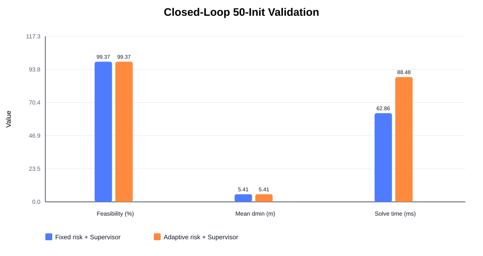
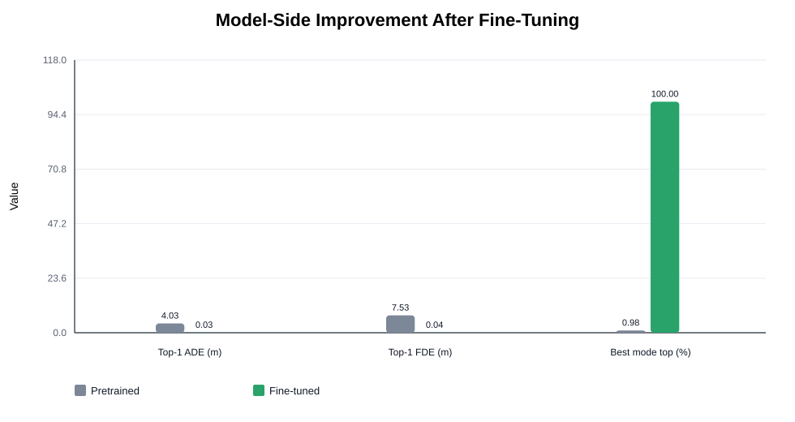
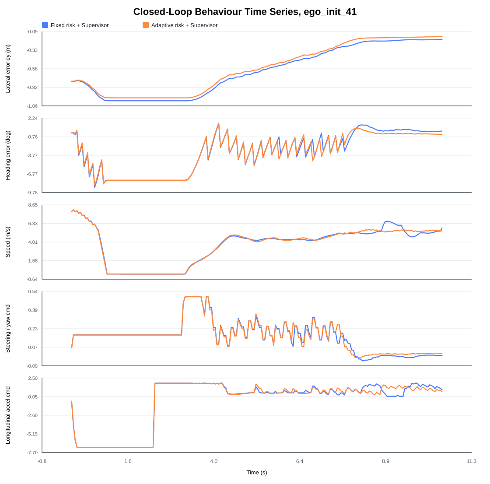
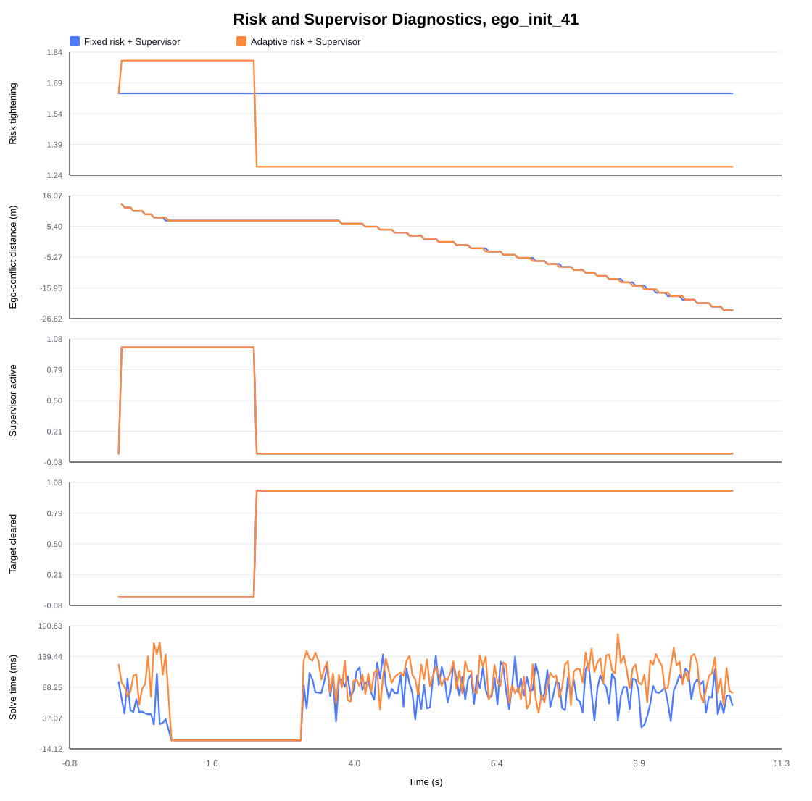

# Graphical Results Summary - Jiaqi

Current improvement has two parts: first, the controller was strengthened from single SMPC to SMPC+Supervisor; second, the MultiPath predictor's CARLA-domain mode-ranking problem was improved by fine-tuning.

## 1. Closed-Loop 50-Init Validation

| Policy                     | Feasibility | Mean centre distance | Worst footprint separation | Gate pass |
| -------------------------- | ----------: | -------------------: | -------------------------: | --------: |
| Fixed risk + Supervisor    |      99.37% |              5.407 m |                    0.871 m |     50/50 |
| Adaptive risk + Supervisor |      99.37% |              5.409 m |                    0.883 m |     50/50 |

Both policies pass all 50 initial conditions. The adaptive-risk policy keeps similar feasibility and mean distance, with a slightly larger worst footprint separation.

## 2. Prediction Model Improvement

| Predictor            | Top-1 ADE | Top-1 FDE | Top-probability mode is best |
| -------------------- | --------: | --------: | ---------------------------: |
| Pretrained MultiPath |  4.0337 m |  7.5259 m |                        0.98% |
| Fine-tuned MultiPath |  0.0271 m |  0.0366 m |                      100.00% |

The improvement comes from a mode-ranking issue in the pretrained predictor. The pretrained model contained a good trajectory mode, but it did not assign that mode the highest probability. After fine-tuning on CARLA give-way data, the correct mode becomes the top-probability mode, so Top-1 ADE/FDE drop sharply.

## 3. Representative Time-Series Behaviour

This representative rollout shows that the lateral error, heading error, speed, steering/yaw command, and acceleration command remain bounded throughout the interaction.

The adaptive-risk controller stays close to the fixed-risk final trajectory because both policies are protected by the same supervisor. The main difference is  a different solver-layer risk allocation while preserving similar executed behaviour. It shows that the proposed method does not trade safety for unstable or aggressive control.

## 4. Phase-Aware Risk Diagnostic

This diagnostic plot shows why the adaptive-risk policy is phase-aware. Before the priority vehicle clears the conflict area, the controller applies stronger risk tightening because of the give-way policy. Once the priority vehicle has passed the conflict region, the ego vehicle no longer needs the same level of conservatism and can continue the manoeuvre more normally.

According to the supervisor-active signal, when the interaction is safety-critical, the supervisor can shape the final executed action. Therefore, the adaptive-risk contribution is best interpreted as a solver-layer phase-aware mechanism, while the supervisor provides the final safety guarantee. As a next step, I plan to reduce unnecessary supervisor intervention, so that the phase-aware adaptive-risk SMPC can have a stronger influence on the executed trajectory and its benefit can be evaluated more clearly.
