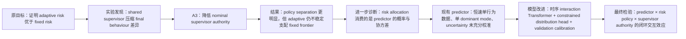

# 两周最终研究主线：数据扩展、模型优化与闭环实验执行方案

> 项目：UCL Dissertation — `Research-Project-IMLS`
>
> 状态：Canonical execution document
>
> 建立日期：2026-07-31
>
> 时间约束：14 天
>
> Day 1 资产审计：`docs/paper/Day1_冻结协议与服务器资产审计报告.md`

## 0. 本文件的决定

从本文件建立之日起，未来两周的新增数据、模型训练、离线评价、CARLA 闭环实验和论文主线以本文件为准。

配套文件：

- `docs/paper/已完成实验与证据账本.md`：已有控制实验与静态-context Transformer pilot；
- `docs/paper/Day1_冻结协议与服务器资产审计报告.md`：服务器资产事实；
- `docs/paper/generated/`：历史控制实验 CSV 与 SVG。

旧计划、重复结果表和一次性分析脚本已在 2026-07-31 清理。第一版“直接在现有 50-rollout dataset 上训练 normalized Transformer”的方案不再有效：问题不是现有样本数绝对不足，而是现有数据不具备足够的 interaction identifiability。

## 1. 数据集是否必须扩展

### 1.1 结论

必须扩展，但必须扩展的是交互行为覆盖，而不是简单增加同分布帧数。

如果论文只把模型作为系统组件，现有 50 rollouts 足以做 predictor sanity check；如果论文要把 interaction-conditioned Transformer 作为核心模型贡献，现有数据不足以支持该论点。

两周内不需要引入 Waymo、nuScenes、Argoverse 或重建大型真实数据集。需要在同一个 CARLA give-way map、同一批 50 ego initialisations、同一预测接口上，增加一个小型、受控、可配对的交互扩展。

### 1.2 现有数据为什么不足

现有正式 prediction dataset：

```text
core/results/20260726_212838_prediction_dataset_collection
```

它有：

- 50 个独立 rollouts；
- 10,236 个 temporal windows；
- 2,441 个 train full-horizon samples；
- 305 个 validation full-horizon samples；
- 305 个 test full-horizon samples；
- 完整 rasters、target history、ego/target current state 和 future labels。

但它只有一种 target 行为：

```text
StraightLineAgent
target nominal speed = 9.0 m/s
target start offset = 0.0 m
target controller does not read ego state
```

`StraightLineAgent.run_step()` 只跟踪固定直线路径和固定目标速度。target 的未来由自身位置、速度和低层控制误差决定，不会因 ego 的位置、速度、意图或让行行为改变。

因此：

```text
P(target future | target history, ego context)
≈ P(target future | target history)
```

在这种数据上，显式 ego-target context 理论上不应提供稳定的额外预测信息。若 Transformer 有小幅改善，也可能来自：

- 更多参数；
- residual head；
- 训练随机性；
- ego state 与 rollout phase 的相关性；
- 同一 rollout 内大量相邻 temporal windows；
- 模型对单一轨迹模式的进一步过拟合。

### 1.3 现有模型还有三个不能忽略的问题

第一，base MultiPath 不能准确称为“target-only”。它的 rasterizer 会绘制场景中的车辆历史，其中包括 ego。正式论文应写：

```text
raster-conditioned MultiPath baseline
```

而不是：

```text
target-only MultiPath
```

新模型检验的是“显式结构化时序交互表示是否提供了 raster scene context 之外的信息”。

第二，现有 Transformer 输入不是完整的时序 interaction：

```text
一个 8 维 current interaction context
→ 在所有 target-history steps 上重复
→ Transformer encoder
```

这使 attention 主要作用于 target history，而 ego-target context 在时间轴上是常量。它不足以支持“temporal interaction modelling”的强表述。

第三，现有 residual head 直接修改整个 MultiPath raw output：

- trajectory means；
- covariance parameters；
- covariance angles；
- mode logits。

现有 pilot 中：

```text
top1 ADE: 0.0268 m → 0.0256 m
top1 FDE: 0.0357 m → 0.0328 m
mode entropy: 0.160 → 0.050
best anchor: all 305 samples are the same anchor
```

误差下降是初步正信号，但单一 dominant mode 与 entropy 大幅收缩也可能代表 overconfidence。没有 mixture NLL、二维 coverage 和 deployment-equivalent covariance audit 前，不能把它写成概率预测或 uncertainty quality 的改善。

### 1.4 什么样的扩展才足够

两周内的最小严谨扩展是：

1. 保留同一 CARLA Town05 give-way 场景；
2. 保留现有 50 ego initialisations；
3. 保留 target route、9.0 m/s nominal speed 和车辆类型；
4. 增加一个受控的 defensive-reactive target style；
5. 同时采集 fixed-medium 与 adaptive `floor_weak` ego policy；
6. 记录真实的 ego-target interaction history sequence；
7. 继续按 init ID 做 grouped split；
8. 不把 temporal windows 当独立场景。

推荐正式扩展规模：

```text
50 ego inits
× 2 target styles
× 2 ego risk policies
= 200 rollouts
```

正式采集时统一保持：

```text
target nominal/init speed = 9.0 m/s
target start offset = 0.0 m
map/route/vehicle type/weather = current frozen give-way setup
```

这不是从头构建数据集。它复用：

- 当前 map；
- scenario；
- 50-init files；
- rasterizer；
- MultiPath logger；
- prediction horizon；
- planner；
- supervisor；
- post-CARLA gate。

新增工作只集中在 target behavior、interaction-sequence logging、collection matrix 和 audit。

### 1.5 为什么 200 rollouts 不是无意义堆量

四个 cell 是受控因子实验：

| Target style | Ego policy | 作用 |
| --- | --- | --- |
| assertive constant-speed | fixed medium | non-reactive negative control，fixed-policy distribution |
| assertive constant-speed | adaptive floor_weak | non-reactive negative control，adaptive-policy distribution |
| defensive reactive | fixed medium | interaction-positive data，fixed-policy distribution |
| defensive reactive | adaptive floor_weak | interaction-positive data，adaptive-policy distribution |

每个 cell 使用相同 50 inits。相同 init 的四个 rollout 必须进入同一个 split：

| Split | Init IDs | Rollouts |
| --- | --- | ---: |
| train | 01–40 | 160 |
| validation | 41–45 | 20 |
| test | 46–50 | 20 |

这样可以避免：

- 同一 init 跨 split；
- target style 与 ego policy 混杂；
- 模型只在 adaptive-generated data 上训练却在 fixed policy 下闭环测试；
- 只改变样本数量而不改变条件支持。

## 2. 最终论文叙事

### 2.1 推荐题目

首选：

```text
Interaction- and Calibration-Aware Prediction for Adaptive-Risk SMPC
at Give-Way Intersections
```

更强调研究过程的备选：

```text
From Adaptive Risk Allocation to Interaction-Aware Prediction:
A Closed-Loop Study at Give-Way Intersections
```

更保守的备选：

```text
Diagnosing Predictor, Risk Allocation and Safety-Supervisor Coupling
in Give-Way Intersection Planning
```

### 2.2 一句话研究问题

```text
在 CARLA give-way 场景中，adaptive-risk SMPC 相对 fixed-risk frontier
的闭环价值，是否同时受 runtime supervisor authority 和
planner-facing prediction distribution quality 限制；显式时序交互预测与
validation-calibrated uncertainty 能否改善该 safety–efficiency frontier？
```

### 2.3 从原课题到新模型的连续逻辑



这不是从 planning 跳到纯模型训练。模型优化直接服务于原问题：

```text
如果 predictor 提供的 uncertainty 不随交互状态可靠变化，
adaptive risk 没有足够信息形成比 fixed risk 更好的动态分配。
```

### 2.4 中心论点

论文不再试图证明：

```text
adaptive risk universally outperforms fixed risk
```

也不预设：

```text
Transformer universally outperforms MultiPath
```

最终中心论点是：

```text
Adaptive risk allocation cannot be evaluated independently of the prediction
distribution and the runtime safety authority. In the original system, the
supervisor masks part of the planner-level difference, while the deterministic
single-behaviour prediction dataset provides little identifiable interaction
signal. A controlled reactive-behaviour extension and a temporal interaction
adapter allow these two bottlenecks to be separated and tested in closed loop.
```

中文表述：

> Adaptive risk 的闭环收益是条件性的：它既需要足够的 nominal planning authority，也需要随交互状态变化且经过校准的预测分布。本文通过 supervisor authority 实验、interaction-negative/positive 数据对照、模型容量对照和 predictor × risk 闭环因子实验，区分这两个限制。

### 2.5 论文贡献

1. 建立并诊断一个包含 MultiPath、chance-constrained SMPC、adaptive risk、rule-aware supervisor 和 post-CARLA gate 的完整 give-way closed-loop pipeline。
2. 通过 supervisor ablation、v12 和 A3 证明 adaptive/fixed 的差异会受到 runtime safety authority 影响，且 adaptive risk 并不自动支配 fixed frontier。
3. 发现现有 deterministic target dataset 无法识别真正的 interaction benefit，并构建最小的 paired assertive/reactive CARLA 扩展。
4. 在 frozen MultiPath 上实现显式时序 interaction adapter，并用 parameter-matched MLP、mean-only head、context ablation 和多 seed 控制额外容量与训练随机性。
5. 通过 calibration-aware offline metrics 和 predictor × risk × supervisor closed-loop evaluation，检验预测改善能否转化为 adaptive-risk planning utility。

### 2.6 不应声称的内容

- 不声称解决一般自动驾驶 motion forecasting；
- 不声称 200 个合成 rollouts 等价于大型自然驾驶数据；
- 不声称 defensive reactive rule 是人类驾驶行为模型；
- 不声称 Transformer 是全新基础架构；
- 不把同一 rollout 的 temporal windows 当独立样本；
- 不把 supervisor 的贡献归给 adaptive risk；
- 不根据 test 或闭环结果选择模型；
- 不只与一个任意 fixed-risk point 比较。

## 3. 研究问题与可证伪假设

### RQ1：为什么原 adaptive-risk 优势没有稳定出现

```text
Shared supervisor authority 是否把 fixed/adaptive 的不同 nominal actions
压缩成相似 final actions？
```

#### H1：Supervisor masking hypothesis

在 high-authority supervisor 下，fixed/adaptive 的 final-trajectory difference 小于 nominal planner difference；转到 A3 risk-owned-yield 后，policy separation 增大，但 adaptive 仍不保证支配 fixed frontier。

已有证据：

- formal supervisor ablation；
- v12 close-stop baseline；
- A1/A2 negative or mixed results；
- A3 12/12 PASS 与更明显 policy separation。

本轮不再为 H1 大规模重跑，只在最终模型上做一个小型 v12/A3 transfer check。

### RQ2：现有数据能否识别 interaction-conditioned prediction

```text
当 target controller 不读取 ego 时，显式 ego interaction context
是否仍能产生可重复、可消融的收益？
```

#### H2：Negative-control identifiability hypothesis

在 assertive constant-speed subset 上，T2 相对 B1/B2-D 不应有大的 context-specific 优势；shuffled/zero ego context 不应显著恶化结果。

若在该 subset 上出现很大的 Transformer 优势，但：

- MLP 同样改善；
- shuffled context 不下降；
- 多 seed 方向不一致；

则改善应归因于 capacity、regularisation 或 rollout correlation，而不是 interaction modelling。

这是一个必要的 negative control，不是希望模型失败。

### RQ3：时序交互表示是否在 reactive subset 上有独立价值

```text
当 target 的 defensive slowdown 由 ego-target conflict state 触发时，
temporal interaction Transformer 是否提供 raster MultiPath 和
parameter-matched MLP 之外的信息？
```

#### H3：Temporal interaction hypothesis

在 defensive-reactive test subset，特别是 pre-response 和 conflict-near windows：

1. T2 优于 B1；
2. T2 优于 parameter-matched B2-D；
3. T2 的 context shuffle/zero-context 性能下降；
4. 三个 seeds 的方向一致；
5. 改善大于 assertive negative-control subset。

关键 interaction contrast：

```text
Delta_context_value
= (T2 - B1)_reactive
  - (T2 - B1)_assertive
```

如果该 contrast 接近零，则不能声称 Transformer 学到了 reactive interaction。

### RQ4：点预测改善是否等于概率预测改善

```text
模型是在降低 mean trajectory error，还是在改善 SMPC 真正使用的
mode probabilities 和 covariance？
```

#### H4：Distribution quality hypothesis

T2-distributional 必须相对 T1-mean-only 至少在以下一类指标上提供额外价值：

- mixture NLL；
- 2D covariance coverage error；
- P90 FDE；
- overconfidence rate；
- pre-response subset 的 probability/covariance behaviour。

如果 mean-only 改善 ADE/FDE，而 distributional head 使 NLL 或 coverage 恶化，则 T1 作为主要部署候选，T2 的 calibration failure 作为结果和限制报告。

### RQ5：预测改善是否被 adaptive risk 利用

```text
经过校准的 interaction prediction 是否改变 adaptive risk 相对
fixed frontier 的 safety–efficiency trade-off？
```

#### H5：Predictor–risk interaction hypothesis

主交互效应：

```text
Delta_PR
= (T2 - B1)_adaptive
  - (T2 - B1)_fixed_medium
```

分别对以下两个 primary outcomes 计算：

```text
min_footprint_separation_m
target_clearance_adjusted_completion_delay_s
```

支持 H5 不要求 adaptive 在每个 condition 都最快且最安全。支持条件是：

1. T2 对 adaptive 的收益与对 fixed medium 的收益存在一致差异；
2. adaptive 在 fixed frontier 中的 domination rate 降低，或安全约束下 delay regret 降低；
3. 改善集中在 reactive / critical timing 条件，而不是所有简单条件；
4. risk tightening、solver 和 intervention 日志提供一致机制链路；
5. 结果不是由单个 init 驱动。

若 H3/H4 成立但 H5 不成立，论文结论为：

```text
The current adaptive-risk mechanism does not effectively exploit the improved
interaction-conditioned predictive distribution.
```

这仍然直接回答原 adaptive-risk 研究问题。

### RQ6：offline improvement 能否解释 closed-loop transfer

#### H6：Tail/calibration transfer hypothesis

在 rollout/critical-phase 聚合后，P90 FDE、NLL 或 coverage error 比 mean ADE 更能解释：

- risk tightening；
- solver failure；
- low-margin events；
- emergency intervention；
- nominal-final action mismatch。

H6 只报告效应量和关联，不在小样本条件下声称严格因果中介。

## 4. 正式数据集设计

### 4.1 两种 target styles

#### S0：assertive constant-speed

复用当前 `StraightLineAgent` 行为：

- 直行；
- nominal speed 9.0 m/s；
- 不读取 ego；
- 不主动让行；
- 作为 interaction-negative control。

#### S1：defensive reactive

新增可配置 target policy，例如：

```text
DefensiveStraightLineAgent
```

它仍是 priority straight-going vehicle，不主动把 right-of-way 让给 ego。只在预测到 conflict timing 重叠且 ego 尚未明显让行时进行有限 defensive slowdown。

行为约束：

1. 沿原直线路径行驶；
2. 只使用当前和历史 actor states，不调用被训练的 predictor；
3. trigger 由物理量定义，例如 distance-to-conflict、time-to-conflict gap 和 ego approach speed；
4. 最大减速度固定并符合普通制动范围；
5. 设定最低目标速度，不在 conflict 前完全停车；
6. trigger/release 使用 hysteresis，避免控制抖动；
7. target clearance 后恢复 9.0 m/s；
8. 每步记录 trigger、desired speed、actual speed、TTC gap 和 control；
9. 参数只允许用 development inits 01–05 调试；
10. 参数冻结后，正式 01–50 batch 不再调整。

S1 是受控合成 interaction，不是自然驾驶真实性证明。它的研究作用是建立：

```text
ego state can change target future
```

从而使 interaction-conditioning 成为可证伪问题。

`target_style` 标签用于 dataset audit、subset evaluation 和配对统计，不直接提供给 predictor。否则模型可能只学习一个行为类别标签，而不是从 observed interaction history 推断 target response。

### 4.2 两种 ego policy

正式 prediction dataset 同时使用：

```text
fixed medium
adaptive floor_weak
```

原因：

- 最终闭环要比较 fixed 与 adaptive；
- 只在 adaptive-generated trajectories 上训练会造成 policy-specific covariate shift；
- 两种 ego policy 能产生不同 approach、yield 和 recovery histories；
- target reactive rule 在不同 ego trajectories 下应有不同 trigger patterns。

### 4.3 Interaction sequence

每个 sample 新增与 target history 对齐的 interaction sequence。推荐 6 个历史时刻：

```text
[-1.0, -0.8, -0.6, -0.4, -0.2, 0.0] s
```

每个 token 至少包含：

```text
time offset
ego relative x in current target-local frame
ego relative y in current target-local frame
target relative x
target relative y
ego speed
target speed
relative longitudinal speed
relative lateral speed
sin(relative yaw)
cos(relative yaw)
ego-target distance
valid-history mask
```

最终字段数量由实现检查后固定，但 train、validation、test 和 online deployment 必须完全一致。

要求：

- 所有位置统一在 current target-local frame；
- 速度与 yaw 坐标约定明确；
- 缺失历史用 mask 表示，不把缺失静默当真实零；
- normalization mean/std 仅由 train split 计算；
- metadata 随 checkpoint 保存；
- online CARLA 使用同一 feature builder 与 normalization；
- 增加 offline/online feature equivalence test。

### 4.4 Dataset version

新数据不得覆盖旧目录。建议：

```text
core/results/<timestamp>_interaction_prediction_dataset_v2
```

Manifest 至少记录：

```text
dataset_version
git_commit
scenario
map
ego_init_id
ego_policy
target_style
target_style_parameters
target_speed
target_offset
prediction_horizon
dt
history_times
feature_schema
source_subrun
raster_count
raw/valid/full-horizon counts
```

### 4.5 Split

固定：

```text
train: init 01–40
validation: init 41–45
test: init 46–50
```

同一 init 下的四个 `{target style × ego policy}` rollouts 必须全部进入同一 split。

禁止：

- frame-level random split；
- 同一 rollout 跨 split；
- 同一 init 的不同 target style 跨 split；
- 使用 test 选择 target behavior threshold；
- 使用 test 选择 normalization、temperature、covariance scale 或 checkpoint。

### 4.6 Development pilot 与正式数据

Day 5 只用 init 01–05 做 target-reactive smoke test，检查：

- trigger 是否永不发生；
- trigger 是否几乎全程发生；
- target 是否完全停车；
- control 是否抖动；
- 是否有碰撞；
- interaction sequence 是否完整；
- logger 与 raster 是否对齐。

推荐 development acceptance：

```text
reactive trigger rollout rate: 20%–80%
target full-stop rate before clearance: 0%
missing interaction token rate after warm-up: 0%
collision rate: 0%
```

这些比例只是开发门，不是论文结论。参数冻结后，pilot 数据丢弃，并使用冻结配置重跑正式 01–50。

## 5. 模型设计

### 5.1 共同基础

所有 adapter 模型复用：

```text
CARLA-finetuned MultiPath checkpoint
same anchors
same raster
same target history
same train/validation split
same training budget
frozen base model
same checkpoint rule
```

所有正式比较报告：

- total parameters；
- trainable parameters；
- artifact size；
- mean/P95 inference latency。

### 5.2 模型组

| ID | 模型 | 作用 | 闭环 |
| --- | --- | --- | --- |
| B0 | original pretrained MultiPath | 证明 CARLA fine-tuning 的作用 | offline + bridge subset |
| B1 | V2-contract CARLA-finetuned MultiPath | 正式共享输入基线 | 必做 |
| B2-M | parameter-matched temporal MLP, mean-only residual | T1 的容量/feature 对照 | offline must |
| B2-D | parameter-matched temporal MLP, distributional residual | T2 的容量/feature/head 对照 | offline must，闭环可选 |
| T0 | 现有 repeated-current-context Transformer | channel-mismatched 历史 pilot | 不重跑正式闭环 |
| T1 | normalized temporal Transformer, mean-only residual | 点预测 head 消融 | offline must，闭环候选 |
| T2 | normalized temporal Transformer, constrained distributional residual | 主要模型 | offline + closed-loop |

若 T2 calibration 不通过 gate，则闭环主要模型改为 T1，不允许为了保持 Transformer 结论而部署失准的 uncertainty head。

Day 3 已确认旧 B1/T0 的 disk raster training loader 与在线 CARLA channel contract 不一致。旧 checkpoint 只能保留为 legacy pilot。正式 B1 必须与 B2/T1/T2 一样，使用 Day 4 冻结的 V2 shared raster builder 和 V2 grouped split 重新 fine-tune。

### 5.3 B2-M/B2-D：参数量相近的 MLP

输入：

```text
interaction sequence
→ masked temporal pooling / flattening
→ MLP
→ MultiPath residual
```

要求：

- 与对应的 T1/T2 使用相同 feature sequence；
- 相同 normalization；
- 相同 frozen base；
- B2-M 与 T1 使用相同 mean-only output head；
- B2-D 与 T2 使用相同 distributional output head；
- 相同 optimizer、epoch 和 checkpoint rule；
- B2-M/T1、B2-D/T2 的 trainable parameter count 分别尽量控制在 ±20%；
- 若无法匹配，报告准确差异并做参数量敏感性说明。

B2-M/B2-D 用来回答：

```text
需要 attention，还是显式 interaction features + extra capacity 已经足够？
```

若对应的 B2 与 Transformer 相当，论文应诚实写：

```text
The benefit is attributable to structured interaction conditioning rather
than the Transformer architecture specifically.
```

### 5.4 T1/T2：真正的时序 interaction Transformer

推荐结构：

```text
interaction tokens + valid mask + time encoding
→ linear token projection
→ 1–2 Transformer encoder blocks
→ masked pooling
→ residual head
→ frozen MultiPath raw output
```

模型保持轻量：

```text
d_model: 32 or 64
heads: 4
layers: 1 or 2
ff_dim: 64 or 128
dropout: 0.1
```

只允许用 validation 在这两个预定义容量之间选择，不做大范围超参数搜索。

本模型只条件化 observed ego-target history，不输入候选 ego future plan，也不做 joint multi-agent trajectory generation。因此论文中使用：

```text
observed-history interaction-conditioned prediction
```

而不使用：

```text
fully joint or counterfactual interactive prediction
```

### 5.5 T1：mean-only residual

T1 只修改每个 mode 的 future XY residual：

```text
mean_new = mean_base + bounded_delta_mean
covariance_new = covariance_base
logits_new = logits_base
```

作用：

- 隔离 trajectory fitting；
- 避免 probability/covariance head 掩盖 mean improvement；
- 当 T2 calibration 失败时提供可部署 fallback。

### 5.6 T2：distributional residual

T2 使用分组、受约束的 heads：

```text
mean residual
covariance-scale/orientation residual
mode-logit residual
```

禁止使用一个无约束 Dense 直接修改所有 raw outputs 而不记录各组尺度。

要求：

- mean residual 有独立 scale；
- covariance scale 为正且有上下界；
- covariance 必须 finite、symmetric、positive definite；
- logit residual 有独立 scale；
- 输出每个 head 的 residual norm；
- evaluator 与 deployment 使用完全相同的 GMM conversion。

### 5.7 Validation-only post-hoc calibration

当前代码使用：

```text
std = exp(abs(raw_std_parameter))
```

它强制标准差不小于 1，并可能造成严重 over-coverage。Day 3 必须先量化，不允许直接假设其正确。

优先采用低风险的 validation-only calibration：

```text
mode temperature tau
global or horizon-wise covariance scale c
```

要求：

1. `tau` 和 `c` 只在 validation rollouts 上拟合；
2. test 只评一次；
3. online deployment 使用同一参数；
4. B1、B2-M、B2-D、T1、T2 使用相同校准协议；
5. 报告 calibration 前后指标；
6. 若改变 covariance parameterization，则所有比较模型必须在相同 contract 下重新训练或重新校准。

### 5.8 随机种子

正式 adapter：

```text
B2-M: seeds 11, 23, 37
B2-D: seeds 11, 23, 37
T1: seeds 11, 23, 37
T2: seeds 11, 23, 37
```

B1 使用冻结 checkpoint，不因新 test 结果重训。

模型选择：

1. 先排除 NaN/invalid covariance；
2. 以 validation mixture NLL 为 T2 主 checkpoint criterion；
3. T1 以 validation rollout-aggregated P90 FDE 或 ADE 选择；
4. 如需 composite score，公式必须在看 test 前冻结；
5. 闭环只使用 validation-selected seed；
6. test 和 closed-loop 不参与 checkpoint/seed 选择。

### 5.9 Context ablations

对 validation-selected T2 checkpoint，至少完成：

| Ablation | 方法 | 回答的问题 |
| --- | --- | --- |
| correct context | 原始序列 | 正式性能 |
| zero/masked ego sequence | 保留 target history，移除 ego interaction | 是否真正依赖 ego |
| shuffled context | 在同一 split 中按 rollout/sample 打乱 ego sequence | 是否依赖正确配对 |
| current-only context | 只保留最后 token | 时序历史是否必要 |

Shuffle 必须固定 seed，并避免把标签、target history 或 raster 一起打乱。

## 6. 离线评价协议

### 6.1 主统计单位

独立 rollout 是主统计单位。

流程：

1. 先对每个 temporal window 计算指标；
2. 再在每个 rollout 内聚合；
3. 最终在 rollout 或 paired init 层面比较；
4. temporal-window 数量只报告为数据规模；
5. 不使用 frame-level p-value 夸大显著性。

### 6.2 预注册 primary offline outcomes

1. rollout-aggregated mixture NLL；
2. rollout-aggregated P90 FDE。

原因：

- NLL 检验完整预测分布；
- P90 FDE 检验规划更敏感的 tail error；
- mean ADE 保留为 secondary，而不是唯一成功标准。

### 6.3 Secondary offline outcomes

- top1 ADE/FDE；
- minADE/minFDE；
- P50/P90 ADE/FDE；
- 1.0 s 与 2.0 s horizon；
- per-step displacement error；
- best-mode counts；
- top-prob mode is best fraction；
- mode entropy；
- effective mode count；
- top1–oracle gap；
- 2D 1σ/2σ/3σ empirical coverage；
- coverage calibration error；
- covariance determinant/sharpness；
- overconfidence rate；
- invalid covariance count；
- inference latency；
- parameter count。

二维 Gaussian ellipse 理论覆盖必须使用相应 chi-square probability，不把二维“1σ”错误写成一维 68%。

### 6.4 预定义 subsets

| Subset | 定义来源 | 作用 |
| --- | --- | --- |
| all | 全部 test | 总体 |
| assertive | target style S0 | negative control |
| reactive | target style S1 | interaction-positive |
| reactive pre-response | trigger 前的固定时间窗 | 防止只利用已经发生的减速 |
| reactive active | target trigger active | response prediction |
| conflict-near | validation/geometry 固定阈值 | planner-relevant |
| small TTC gap | validation/physical threshold | hard interaction |
| baseline tail | B1 validation quantile | tail transfer |

所有阈值必须在 validation 或物理定义上冻结，不根据 test 调整。

### 6.5 Offline model gate

T2 进入主闭环必须全部满足：

1. split audit 无 leakage；
2. 3 seeds 均可训练和加载；
3. evaluator/deployment equivalence 通过；
4. invalid covariance rate 为 0；
5. context feature offline/online equivalence 通过；
6. 在 reactive subset 的 NLL 或 P90 FDE 至少一项优于 B1；
7. context shuffle/zero 造成方向正确的退化；
8. 相对 B2-D 存在可解释优势，或明确降级 claim 为 structured-context benefit；
9. assertive subset 没有异常的大 context-only gain；
10. calibration 不明显回归。

若 T2 不通过而 T1 通过，则闭环部署 T1，论文报告 distributional adaptation failure。

## 7. 闭环实验设计

### 7.1 为什么主闭环使用 A3

A3 risk-owned-yield：

- 保留 emergency braking 和 footprint-clearance guard；
- 降低 nominal deterministic supervisor takeover；
- 已有 12/12 PASS；
- 更容易观察 prediction → risk → solver → final action 的链路。

因此 A3 是主模型比较环境。v12 用作 supervisor-masking robustness，不再承担主结论。

### 7.2 In-distribution formal conditions

ID 条件与正式 prediction dataset 一致：

```text
ego init: 46–50
target style: assertive / reactive
target offset: 0.0 m
target nominal speed: 9.0 m/s
```

共 10 个 paired conditions：

| Condition | Init | Target style |
| --- | ---: | --- |
| ID01 | 46 | assertive |
| ID02 | 46 | reactive |
| ID03 | 47 | assertive |
| ID04 | 47 | reactive |
| ID05 | 48 | assertive |
| ID06 | 48 | reactive |
| ID07 | 49 | assertive |
| ID08 | 49 | reactive |
| ID09 | 50 | assertive |
| ID10 | 50 | reactive |

### 7.3 主 A3 fixed-frontier matrix

| Predictor | Risk policy |
| --- | --- |
| B1 fine-tuned MultiPath | fixed aggressive |
| B1 | fixed medium |
| B1 | fixed conservative |
| B1 | adaptive floor_weak |
| selected Transformer（T2；若失败则 T1） | fixed aggressive |
| selected Transformer | fixed medium |
| selected Transformer | fixed conservative |
| selected Transformer | adaptive floor_weak |

每组运行 ID01–ID10：

```text
2 predictors × 4 risk policies × 10 conditions
= 80 rollouts
```

这 80 个 rollouts 是最终 closed-loop 主证据。不能为了节省时间只保留 fixed medium，因为原论文问题要求 adaptive 与 fixed frontier 公平比较。

### 7.4 Fine-tuning bridge experiment

为了支撑论文从 pretrained MultiPath 到 CARLA fine-tuning 的叙事，在 A3 ID01–ID10 上增加：

```text
B0 pretrained MultiPath
× fixed medium / adaptive floor_weak
× 10 conditions
= 20 rollouts
```

这些结果与主矩阵中 B1 的相同两组直接配对，回答：

```text
CARLA fine-tuning 的 offline 改善是否改变 fixed/adaptive closed-loop behaviour？
```

如果 B0 无法通过部署 smoke 或产生 invalid GMM，不为了补表而进入正式 CARLA；应报告 pretrained domain mismatch，并以 B0 offline、B1 closed-loop 作为合理边界。

### 7.5 Timing-shift robustness

使用：

```text
ego init: 46–50
target style: assertive / reactive
target offset: -3.0 m / +3.0 m
target speed: 9.0 m/s
```

共 20 个 conditions，只运行：

```text
B1 / selected Transformer
× fixed medium / adaptive floor_weak
× 20 conditions
= 80 rollouts
```

这部分检验模型在 arrival timing shift 下的 transfer，不用于训练或选模型。

### 7.6 v12 supervisor-masking robustness

若 A3 主 80 rollouts 与 timing-shift 80 rollouts 完成，选择五个预注册 conditions：

```text
ID01, ID04, ID05, ID08, ID10
```

运行：

```text
B1 / selected Transformer
× fixed medium / adaptive floor_weak
× 5 conditions
= 20 rollouts
```

作用：

```text
同一个 predictor upgrade 在 v12 与 A3 中的 final effect 是否不同？
```

### 7.7 可删减优先级

不可删：

1. 数据审计；
2. 200-rollout paired dataset；
3. B0/B1/B2-M/B2-D/T1/T2 offline evaluation；
4. 3 seeds；
5. calibration；
6. context ablation；
7. A3 主 80-rollout fixed frontier。

可按顺序删减：

1. v12 20-rollout robustness；
2. timing-shift 80 rollouts 中的部分 conditions，但必须保留正负 offset 和两种 target styles；
3. B2-D closed-loop；
4. 额外 hyperparameter search。

不可为了跑更多 CARLA 而删除 head-matched MLP controls、context ablation 或 calibration。

## 8. 闭环评价

### 8.1 Primary outcomes

继续冻结：

1. `min_footprint_separation_m`；
2. `target_clearance_adjusted_completion_delay_s`。

第二个指标：

```text
ego valid completion time - target conflict-zone clearance time
```

未完成、target 未 clearance 或缺失值的处理必须在正式 batch 前编码并冻结。

### 8.2 Adaptive-vs-fixed frontier 结果

不能只报告 adaptive 与 fixed medium 的均值。

每个 condition 至少计算：

- adaptive 是否被任一 fixed arm Pareto-dominate；
- adaptive domination rate；
- safety-constrained delay regret；
- highest-margin arm；
- fastest safe arm；
- predictor upgrade 后 frontier 是否移动；
- adaptive 相对 frontier 的位置是否改善。

### 8.3 Mechanism metrics

- gate pass/fail；
- collision；
- yield-order violation；
- completion valid；
- completion time；
- first-stop distance；
- waiting time；
- solver failure fraction/phase；
- risk tightening/phase；
- supervisor active fraction；
- direct takeover fraction；
- emergency intervention fraction；
- nominal-final action mismatch；
- mean/P95 solve time；
- P95/RMS jerk；
- model inference mean/P95 latency；
- per-step prediction NLL/error before critical events。

### 8.4 Prediction-to-control logging chain

每步至少记录：

```text
dataset/model identifier
model artifact hash
seed
calibration parameters
target style and reactive trigger
mode probabilities and entropy
covariance determinant
prediction error when label becomes available
risk tightening and risk phase
distance/TTC to conflict
solver status
nominal action
final action
supervisor intervention mode
```

目标链路：

```text
interaction history
→ predictive distribution
→ adaptive risk tightening
→ solver feasibility/action
→ supervisor
→ executed trajectory
```

### 8.5 统计

- paired by init/condition；
- rollout-level aggregation；
- paired/cluster bootstrap 95% CI；
- 报告 raw individual condition values；
- 报告 effect size，不以 `p < 0.05` 作为唯一判断；
- 不把 5 个 test inits 包装成大样本；
- seed variation 与 scenario variation 分开报告。

## 9. 结果解释矩阵

### Case A：T2 通过 offline 且改善 adaptive frontier

可以写：

> Calibrated temporal interaction prediction improved the planner-facing distribution and selectively benefited adaptive-risk SMPC under lower nominal supervisor authority.

仍不能写：

> Adaptive risk is universally superior.

### Case B：T2 offline 改善，但 fixed 与 adaptive 同等受益

结论：

> Predictor quality shifts the planning frontier, but the current adaptive-risk mechanism does not extract more value from the improved distribution than fixed risk.

这是对原 adaptive 主题的直接机制结论。

### Case C：T2 offline 改善，A3 有作用，v12 无作用

结论：

> Closed-loop transfer of prediction improvements depends on runtime authority; a stronger nominal supervisor masks both risk-policy and predictor differences.

这是最能统一前后实验的结果之一。

### Case D：对应的 MLP 与 Transformer 相当

结论：

> Explicit structured interaction features are useful, but attention is not necessary at the scale and diversity of this dataset.

这里分别比较 `B2-M vs T1` 和 `B2-D vs T2`，不跨 output-head 类型比较。

论文模型贡献降级为 interaction-conditioned adapter，不强行强调 Transformer superiority。

### Case E：T1 改善，T2 calibration 失败

结论：

> Mean adaptation was robust, whereas joint modification of probabilities and covariance caused miscalibration. Distributional prediction requires stronger constraints than point-trajectory fitting.

闭环部署 T1。

### Case F：reactive subset 中 context ablation 不下降

结论：

> The model did not use the intended ego-target interaction sequence; any gain is attributable to capacity, raster context or target-history fitting.

不得声称 interaction-aware success。

### Case G：所有模型均无可靠改善

结论不是“项目失败”，而是：

> Within a rule-constrained single-intersection synthetic benchmark, neither adaptive risk scheduling nor a lightweight interaction adapter robustly dominates well-tuned fixed-risk and raster-conditioned baselines.

论文贡献转为严格的 negative/mixed closed-loop evaluation，但前提是对照与审计完整。

## 10. 十四天执行计划

### Day 1：资产与协议冻结

状态：已完成。

产物：

```text
docs/paper/Day1_冻结协议与服务器资产审计报告.md
```

### Day 2：数据审计与 V2 schema 冻结

执行状态：已完成。机器可读结果和解释见：

```text
docs/paper/Day2_数据审计与V2协议冻结报告.md
```

助手执行：

1. 拉取/读取 merged manifest 与 JSONL metadata；
2. 实现 `audit_prediction_dataset.py`；
3. 验证旧数据 split、重复 ID、raster、horizon 和计数；
4. 输出旧数据中 ego/target/context 的分布；
5. 验证 base raster 是否包含 ego；
6. 定义 V2 interaction sequence schema；
7. 定义 dataset version/manifest；
8. 冻结 200-rollout collection matrix。

完成门：

```text
旧数据无 leakage；
明确旧数据只能作为 deterministic negative-control pilot；
V2 feature schema 与 collection manifest 已冻结。
```

### Day 3：GMM evaluator 与 calibration

执行状态：已完成。结果、输入通道诊断和 calibration failure 见：

```text
docs/paper/Day3_GMM评估器与校准报告.md
```

助手执行：

1. 对齐 evaluator 与 `DeployMultiPath._make_gmm()`；
2. 增加 mixture NLL；
3. 增加二维 covariance coverage；
4. 增加 invalid covariance audit；
5. 增加 rollout-level aggregation；
6. 量化 `exp(abs(raw))` 的 coverage；
7. 实现 validation-only temperature/covariance scaling；
8. 建立同一 sample offline/online equivalence test。

完成门：

```text
同一 raw output 在 evaluator/deployment 中的 probabilities、means、
covariances 一致；B1 能生成完整 accuracy + calibration report。
```

### Day 4：时序 interaction logger 与 reactive target

执行状态：已完成。实现、四单元 CARLA smoke、输入等价证据和 Day 5 风险见：

```text
docs/paper/Day4_V2交互数据链路与ReactiveTarget报告.md
```

助手执行：

1. 冻结 V2 raster channel contract；
2. 实现 offline/online 共用 raster loader/preprocessor；
3. 增加逐像素与 preprocessed tensor equivalence test；
4. 实现 aligned ego-target history extraction；
5. 在 sample 中记录 interaction sequence 和 mask；
6. 实现 offline/online 共用 interaction feature builder；
7. 实现 defensive-reactive target policy；
8. 记录 trigger/release/TTC/speed；
9. 新增 V2 collection script；
10. 增加 unit/static tests。

完成门：

```text
代码可生成 S0/S1 × fixed/adaptive 的单场景 V2 sample；
在线模型输入与离线 sample feature 一致。
```

### Day 5：开发 smoke 与参数冻结

执行状态：已完成。完整结果、参数和边界见：

```text
docs/paper/Day5_开发实验与Reactive参数冻结报告.md
docs/paper/generated/day5/day5_final_6b71ccc_audit.json
docs/paper/generated/day5/day5_final_6b71ccc_frozen_config.json
```

只用 init 01–05：

1. 启动 CARLA/Gurobi；
2. 运行 S0/S1 smoke；
3. 检查 reactive trigger coverage；
4. 检查 target 不停车、不碰撞、不抖动；
5. 检查 raster/JSONL/sequence；
6. 冻结 reactive rule；
7. 删除或明确隔离 pilot data；
8. 生成 frozen collection config hash。

完成门：

```text
reactive behavior 既非永不触发，也非全程触发；
正式参数冻结。
```

### Day 6：正式 200-rollout 数据采集

运行：

```text
50 inits × 2 target styles × 2 ego policies
```

要求：

- 可 resume；
- 技术失败用完全相同配置重跑；
- 不调整行为参数；
- 数据写入 `/root/autodl-tmp`；
- 生成 batch summary 和 hashes。

完成门：

```text
四个 cells 均为 50 rollouts；
无配置漂移；
正式数据集完整。
```

### Day 7：V2 merge、split audit 与模型实现

1. 合并 V2 JSONL；
2. grouped split；
3. audit 160/20/20 rollouts；
4. 统计 full-horizon samples；
5. 计算 train-only normalization；
6. 实现 V2-contract B1 fine-tuning；
7. 实现 B2-M、B2-D、T1、T2；
8. 实现分组 residual heads；
9. 运行小样本 overfit 和 shape tests。

完成门：

```text
无 leakage；
模型能在小样本上前向、反向、保存、加载；
normalization metadata 完整。
```

### Day 8：三 seed 训练、离线冻结

1. B1/B2-M/B2-D/T1/T2 × seeds 11/23/37；
2. validation checkpoint selection；
3. validation-only calibration；
4. test 一次性评价；
5. assertive/reactive/pre-response subsets；
6. context ablations；
7. latency 与 parameter count；
8. 选择 closed-loop model；
9. 冻结 model manifest/hash。

完成门：

```text
selected model 满足 Offline model gate；
test 后不再修改模型。
```

### Day 9：部署与 smoke

1. 部署 selected model；
2. 加载 normalization/calibration；
3. CARLA warm-up；
4. B1/selected model × fixed/adaptive；
5. 检查 prediction-control logging；
6. post-CARLA gate；
7. smoke 不计入正式结果。

完成门：

```text
所有模型、GMM、solver、日志和 gate 正常；
无 NaN/Inf/invalid covariance。
```

### Day 10：A3 主 fixed-frontier matrix

运行 80-rollout 主矩阵：

```text
2 predictors × 4 risk policies × ID01–ID10
```

随后运行最多 20-rollout fine-tuning bridge：

```text
B0 × fixed medium/adaptive × ID01–ID10
```

只允许重跑技术失败，不允许改 threshold/model/risk/supervisor。

### Day 11：Timing-shift robustness

运行最多 80 rollouts：

```text
2 predictors × fixed medium/adaptive × 20 shifted conditions
```

若时间不足，按预注册 balanced subset 缩减，不根据 Day 10 结果挑 condition。

### Day 12：v12 robustness 与结果审计

1. 若时间允许运行 20-rollout v12 subset；
2. 拉取全部结果；
3. 校验 expected/completed/missing/failed arms；
4. 检查 model hash/config hash；
5. 生成不可变 result manifest。

### Day 13：统计、表格和图

必须产出：

1. dissertation narrative/evidence table；
2. dataset factorial table；
3. offline model table；
4. context ablation table；
5. calibration plot；
6. assertive vs reactive interaction contrast；
7. A3 fixed frontier；
8. predictor × risk interaction plot；
9. prediction → risk → solver → supervisor mechanism plot；
10. limitation table。

### Day 14：论文 Results、Discussion 与证据冻结

1. 按实际 Case A–G 选择结论；
2. 更新 Abstract、Introduction contributions；
3. 完成 Method 和 Experiment Setup；
4. 写 Results，不隐藏 mixed/negative results；
5. 写 Discussion 和 threats to validity；
6. 核对每个数字的源文件；
7. 冻结 final manifest、commit、tables 和 figures。

## 11. 每一步的协作方式

用户不需要自行理解或修改自动驾驶代码。后续每个 Day 由助手按以下流程推进：

1. 读取上一步产物与完成门；
2. 解释本步要回答的唯一问题；
3. 在本地实现最小代码改动；
4. 运行静态检查、unit test 或本地可执行验证；
5. 给出服务器同步和运行命令；
6. 在获得当步服务器操作授权后执行或协助执行；
7. 拉取并审计结果；
8. 用表格解释结果意味着什么；
9. 更新本 canonical 文档的 checklist；
10. 只有通过 gate 才进入下一步。

服务器安全边界：

- 不把密码、license 或 token 写入仓库；
- 不盲目覆盖服务器未跟踪 checkpoints；
- 不在未核对 `git status` 时镜像同步；
- 不删除旧数据和旧结果；
- 正式结果写入新 timestamp directory；
- 技术失败重跑使用同一 frozen config。

## 12. 优先级与停止规则

### 12.1 优先级

```text
数据可识别性
> evaluator/deployment 一致性
> calibration
> MLP/context controls
> 多 seed
> A3 fixed frontier
> timing robustness
> v12 robustness
> 额外模型容量搜索
```

### 12.2 阻断规则

- split leakage 未解决：不训练；
- reactive behavior 未冻结：不采正式数据；
- interaction sequence offline/online 不一致：不训练正式模型；
- GMM evaluator/deploy 不一致：不计算正式 test；
- invalid covariance：不进入 CARLA；
- test 被用于模型选择：该结果作废并重新定义 protocol；
- model/config hash 不一致：该 rollout 不进入正式结果；
- smoke 日志不完整：不跑主矩阵；
- 主 80 rollouts 未完成：不优先做 v12 optional robustness。

### 12.3 两周时间不足时的正确收缩

可以减少：

- timing-shift condition 数；
- v12 robustness；
- B2-D closed-loop；
- 额外 Transformer capacity。

不能减少：

- paired interaction data；
- grouped split；
- head-matched MLP controls；
- context ablation；
- calibration；
- 3 seeds；
- fixed-risk frontier。

## 13. 论文结构

### Chapter 1 Introduction

- give-way intersection 的 safety–efficiency trade-off；
- adaptive risk 的原始动机；
- prediction、planning 与 runtime safety authority 耦合；
- 研究问题和贡献。

### Chapter 2 Related Work

- MultiPath 与 multimodal trajectory distributions；
- interaction-aware/attention-based motion prediction；
- chance-constrained SMPC 与 risk allocation；
- runtime safety supervisor；
- offline prediction 与 closed-loop planning utility。

### Chapter 3 System and Initial Planning Study

- CARLA scenario；
- MultiPath → SMPC → supervisor pipeline；
- fixed/adaptive risk；
- post-CARLA gate；
- supervisor ablation、v12、A1/A2、A3。

### Chapter 4 Interaction- and Calibration-Aware Prediction

- deterministic dataset limitation；
- paired dataset extension；
- temporal interaction feature；
- B2-M/B2-D/T1/T2；
- GMM calibration；
- training/split protocol。

### Chapter 5 Experiments

- RQ1–RQ6；
- offline metrics；
- context/capacity/head ablations；
- A3 fixed frontier；
- timing shift；
- v12 robustness；
- statistics。

### Chapter 6 Results

- planning diagnosis；
- dataset and model results；
- calibration；
- closed-loop transfer；
- predictor × risk × supervisor interaction。

### Chapter 7 Discussion

- adaptive risk 何时有价值；
- supervisor masking；
- prediction distribution vs mean accuracy；
- Transformer 是否真的必要；
- synthetic interaction limitation；
- small test-init limitation；
- future naturalistic dataset work。

## 14. 文献定位

模型设计可以引用以下基础工作：

1. Chai et al., *MultiPath: Multiple Probabilistic Anchor Trajectory Hypotheses for Behavior Prediction* — <https://arxiv.org/abs/1910.05449>
2. Ngiam et al., *Scene Transformer: A Unified Architecture for Predicting Multiple Agent Trajectories* — <https://arxiv.org/abs/2106.08417>
3. Nayakanti et al., *Wayformer: Motion Forecasting via Simple & Efficient Attention Networks* — <https://arxiv.org/abs/2207.05844>

引用这些工作时必须保持范围：

- 本项目沿用 MultiPath 的 anchor-based probabilistic output；
- Transformer 的动机是融合时间变化的 agent interaction；
- 本项目是轻量 residual adaptation，不声称复现完整 Scene Transformer 或 Wayformer。

## 15. 当前下一步

Day 5 已完成。下一步执行 Day 6：

```text
init 01–50 × four-cell formal collection = 200 rollouts
+ strictly use frozen collection config
+ resume technical failures with identical configuration
+ preserve train/validation/test split by init ID
+ do not alter reactive behavior after collection starts
```

Day 5 已确认：

1. init01–05 × four cells 共 20/20 rollouts 和 1,055 prediction samples 完成，移动到统一云端结果目录后复审仍为 19/19 gates PASS；
2. raster hash、interaction sequence 重建与完整输入契约全部通过；
3. reactive trigger coverage 为 80%，onset 为 0.75–0.85 s，init03 保留 matched no-trigger counterfactual；
4. 每条触发轨迹仅一次 trigger/release，最低 target speed 4.124 m/s并恢复至至少 8.0 m/s；
5. CARLA 原生 collision event 为 0，最小 full-rate centroid clearance 为 3.800 m；
6. paired S1–S0 median maximum target separation 为 4.880 m；
7. reactive parameter hash 与完整 collection config hash 已冻结，Day 6 后禁止调整；
8. target control 无 throttle/brake overlap、无直接 propulsion–braking 反转，触发轨迹只有一次 desired-speed 下降/恢复。
