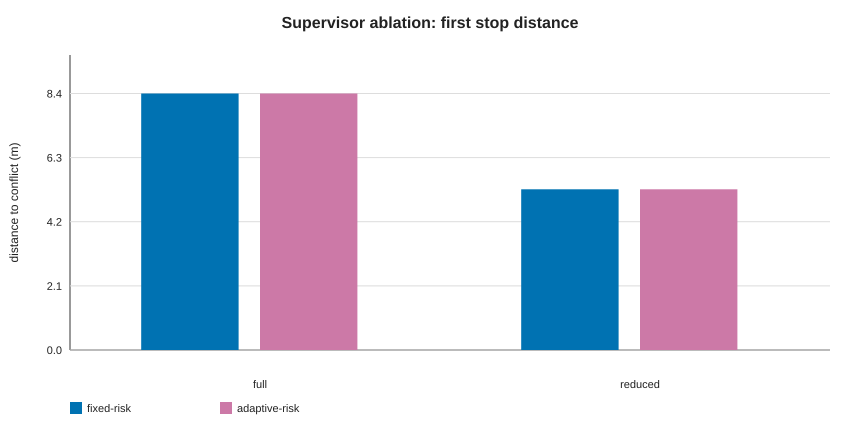
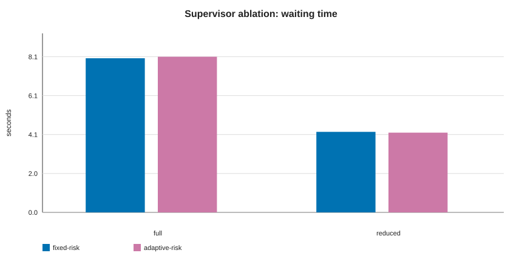
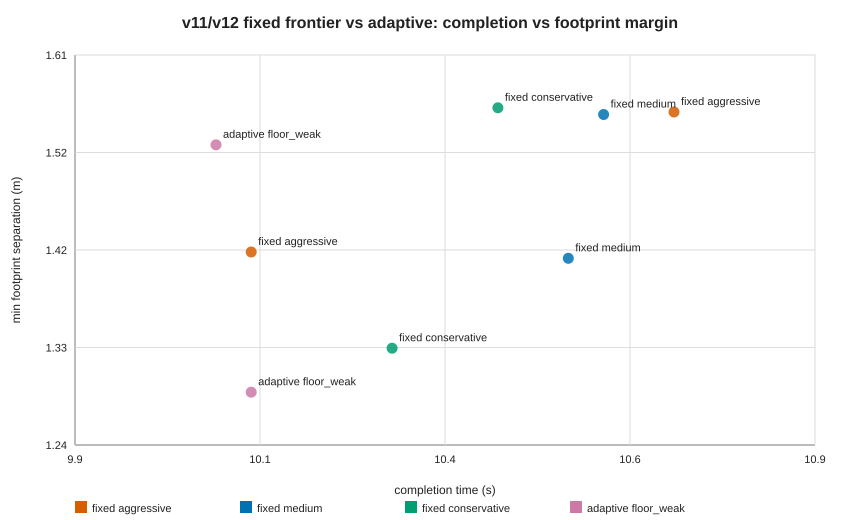
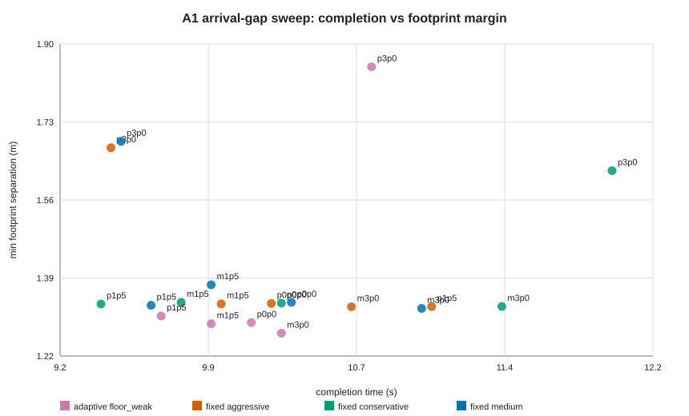
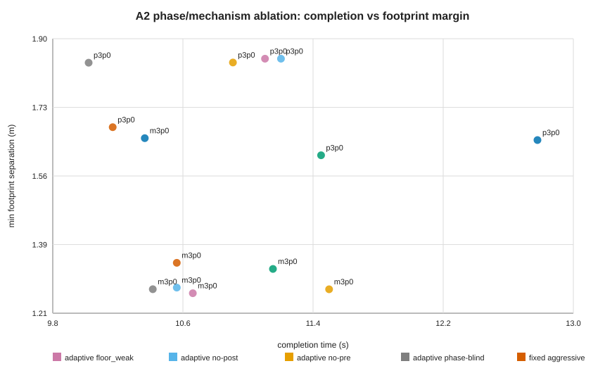
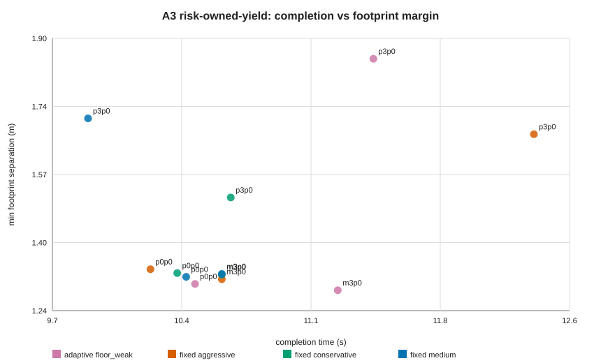
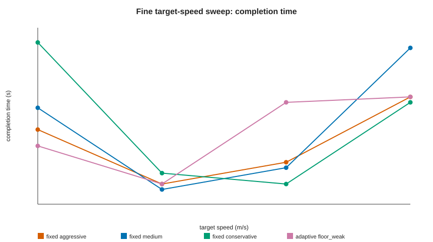
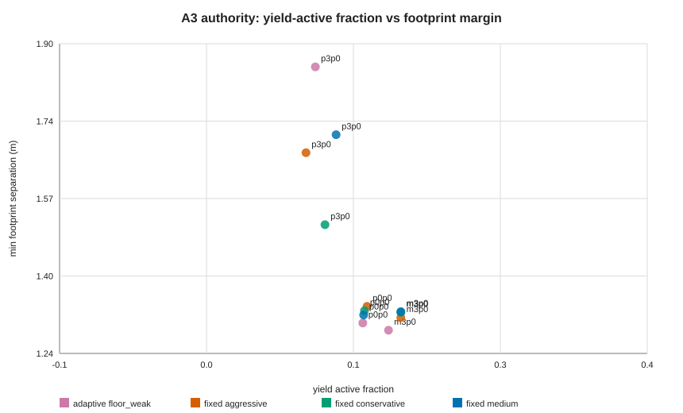

# 当前结果证据表与论文图表说明

本文档把当前 dissertation 的已完成结果整理成论文 Results/Discussion 可用的 evidence tables 和 figures。它不替代主指导书；主指导书仍是 `论文实验与写作统一指导.md`。本文档的作用是把“现有哪些证据、每张表/图服务哪个论点、哪些 claim 不能写”收束到一处。

## 1. 当前论文主线

推荐主线不是 `adaptive-risk SMPC universally dominates fixed-risk SMPC`，而是：

```text
Risk-aware SMPC under rule-aware safety supervision:
when does adaptive risk allocation affect closed-loop behaviour,
and when is it hidden by the supervisor's nominal yield authority?
```

当前最稳的总判断：

- 系统性正结果：supervisor diagnosis 和 v12 close-stop baseline 是强证据。
- fixed/adaptive 对比结果：fixed-risk frontier 很强，adaptive-risk 没有稳定 final-metric dominance。
- 研究价值：A1/A2/A3 把问题推进到 supervisor authority / risk ownership，而不是单纯参数胜负。
- 论文写法：强调 risk-aware planner 的贡献必须和 runtime safety authority 一起评价。

## 2. Evidence Ledger

CSV: [`evidence_ledger.csv`](generated/evidence_tables/evidence_ledger.csv)

| question | status | main_evidence | paper_claim |
| --- | --- | --- | --- |
| Q0 early stop source | strong positive | Reduced supervisor moves first stop from about 8.40m to 5.26m and halves waiting/delay. | Conservative early stopping mainly comes from supervisor/yield logic. |
| Q1 close-stop baseline safety | strong positive | v12 close-stop 4.0m passes all four SMPC arms; first stop around 4.51-4.55m. | Closer give-way stopping is feasible after executable SMPC approach braking and planner-ownership stress. |
| Q2 target-speed fixed-risk failure | negative replication | Coarse 9.0m/s fixed-conservative failure did not reproduce; fine sweep 16/16 PASS. | Speed-only difficulty is not sufficient main proof of adaptive advantage. |
| Q3 arrival-gap hard subset | mixed / limitation | A1 20/20 PASS; adaptive fastest at m3p0 but lowest margin; safest at p3p0 but slower. | Arrival timing exposes trade-offs but not stable fixed-risk failure. |
| Q4 phase-aware adaptive mechanism | negative mechanism ablation | Phase-blind is faster with similar margin at p3p0; fixed medium beats full adaptive at m3p0. | Phase-aware risk is visible in logs but not necessary for current final metrics. |
| Q5 predictor sanity | partially complete | Closed-loop 50-init fine-tuned validation exists; paper still needs ADE/FDE/mode ranking table. | Use predictor results as sanity support, not as the main contribution. |
| Q6 infeasibility phase | partially complete | Existing infeasibility summary places failures mainly in critical/pre-clearance phases. | Solver infeasibility and final closed-loop safety must be reported separately. |
| Q7 risk-owned-yield / supervisor authority | high-value limitation | A3 12/12 PASS and risk-owned-yield active, but fixed frontier remains competitive. | Planner risk contribution depends on supervisor authority; adaptive is not universally dominant. |

## 3. Table Set for Paper Results

| Table | 文件 | 论文用途 |
| --- | --- | --- |
| T1 Evidence ledger | [`evidence_ledger.csv`](generated/evidence_tables/evidence_ledger.csv) | Results 开头总览：哪些问题已解决，哪些是 limitation。 |
| T2 Supervisor ablation | [`supervisor_ablation_table.csv`](generated/evidence_tables/supervisor_ablation_table.csv) | 回答 early stop 是否来自 supervisor。 |
| T3 Baseline progression | [`baseline_progression_table.csv`](generated/evidence_tables/baseline_progression_table.csv) | 说明 v10→v11→v12 如何从 early braking 到 close-stop baseline。 |
| T4 Fine target-speed sweep | [`target_speed_fine_sweep_table.csv`](generated/evidence_tables/target_speed_fine_sweep_table.csv) | 说明 speed-only failure 不稳定，不能作为主证据。 |
| T5 A1 arrival-gap sweep | [`arrival_gap_a1_table.csv`](generated/evidence_tables/arrival_gap_a1_table.csv) | 展示 interaction-timing sensitivity 和 fixed frontier 强度。 |
| T6 A2 mechanism ablation | [`phase_ablation_a2_table.csv`](generated/evidence_tables/phase_ablation_a2_table.csv) | 展示 phase-aware adaptive 未转化为 stable final advantage。 |
| T7 A3 risk-owned-yield | [`risk_owned_yield_a3_table.csv`](generated/evidence_tables/risk_owned_yield_a3_table.csv) | 展示降低 supervisor authority 后仍 PASS，但 adaptive 不 dominate。 |
| T8 A3 authority metrics | [`a3_authority_metrics_table.csv`](generated/evidence_tables/a3_authority_metrics_table.csv) | 验证 A3 regime 确实启用，并量化接管比例。 |
| T9 Infeasibility phase | [`infeasibility_phase_table.csv`](generated/evidence_tables/infeasibility_phase_table.csv) | formal supervisor ablation 的 phase-level infeasibility 证据。 |
| T10 Infeasibility final table | [`infeasibility_final_table.csv`](generated/evidence_tables/infeasibility_final_table.csv) | 汇总 v12 / speed / A1 / A2 / A3 的 solver failure、gate 和 phase 可用性。 |
| T11 Predictor final sanity | [`predictor_sanity_final_table.csv`](generated/evidence_tables/predictor_sanity_final_table.csv) | 当前可写 predictor sanity；明确 FDE/minADE/mode-ranking 仍缺原始结果。 |
| T12 Predictor closed-loop sanity | [`predictor_closed_loop_sanity_table.csv`](generated/evidence_tables/predictor_closed_loop_sanity_table.csv) | predictor 作为闭环系统输入时的 sanity check。 |

## 4. Figure Set for Paper Results

### Fig. 1 Supervisor Causes Conservative Early Stop



*Fig. 1. Full vs reduced supervisor: first-stop distance moves from about 8.4m to 5.26m.*

论文用途：直接回应老师关于 early stop 的问题。这个结果应写成 supervisor/yield logic diagnosis，不能写成 adaptive-risk contribution。

### Fig. 2 Reduced Supervisor Improves Waiting Behaviour



*Fig. 2. Full vs reduced supervisor: waiting time decreases under reduced intervention.*

论文用途：说明 reduced intervention 改善 conservative behaviour，同时仍需 post-CARLA safety gate 约束。

### Fig. 3 v11/v12 Shared Baseline Frontier



*Fig. 3. v11/v12 fixed frontier and adaptive floor_weak in completion-margin space.*

论文用途：说明 v12 close-stop 是 shared baseline improvement。它解决停车距离问题，但不证明 adaptive 优势。

### Fig. 4 A1 Arrival-Gap Sweep



*Fig. 4. A1 arrival-gap sweep: interaction timing changes trade-off but does not create stable fixed-risk failure.*

论文用途：A1 是 sensitivity analysis。可写：arrival timing matters, but fixed frontier remains competitive。

### Fig. 5 A2 Mechanism Ablation



*Fig. 5. A2 phase/mechanism ablation: full phase-aware adaptive does not dominate phase-blind or fixed frontier.*

论文用途：这是重要 negative mechanism ablation。要写成 limitation：phase-aware allocation 在 solver logs 可见，但 final metrics 未稳定受益。

### Fig. 6 A3 Risk-Owned-Yield



*Fig. 6. A3 risk-owned-yield: lower supervisor authority remains safe but fixed frontier is still competitive.*

论文用途：A3 是 supervisor-authority / risk-ownership experiment。可写：降低 nominal takeover 后 policy separation 更可见；不可写 adaptive dominates fixed。

### Fig. 7 Fine Target-Speed Sweep



*Fig. 7. Fine speed sweep around 9.0m/s: coarse fixed-conservative failure is not reproduced.*

论文用途：解释为什么 speed-only sweep 不作为主证据。

### Fig. 8 A3 Authority Metric



*Fig. 8. A3 yield-active fraction vs footprint margin.*

论文用途：补充说明 lower-authority regime 下仍有 emergency/footprint guard activity；评价 planner 必须同时看 final safety 和 authority boundary。

## 5. Key Result Tables Embedded

### 5.1 Supervisor Ablation

| supervisor_mode | policy | n_rollouts | first_stop_distance_to_conflict_m | waiting_time_after_first_stop_s | delay_after_target_clearance_s | supervisor_active_fraction |
| --- | --- | --- | --- | --- | --- | --- |
| full | fixed-risk | 5 | 8.403 | 8.040 | 3.720 | 0.222 |
| full | adaptive-risk | 5 | 8.402 | 8.120 | 3.720 | 0.223 |
| reduced | fixed-risk | 5 | 5.263 | 4.200 | 1.440 | 0.170 |
| reduced | adaptive-risk | 5 | 5.263 | 4.160 | 1.400 | 0.173 |

Interpretation:

- `full` supervisor creates far early stopping around `8.40m`.
- `reduced` supervisor moves first stop to about `5.26m`, and reduces waiting / post-clearance delay.
- Fixed and adaptive both benefit similarly, so this is shared architecture evidence.

### 5.2 Baseline Progression

| run | label | gate_status | completion_time_s | first_stop_distance_to_conflict_m | min_footprint_separation_m | solver_failure_frac |
| --- | --- | --- | --- | --- | --- | --- |
| v10 executable approach braking | fixed medium | PASS | 10.600 | 4.905 | 1.563 | 0.009 |
| v10 executable approach braking | adaptive floor_weak | PASS | 10.050 | 4.891 | 1.529 | 0.010 |
| v11 planner-ownership stress | fixed aggressive | PASS | 10.700 | 4.892 | 1.555 | 0.005 |
| v11 planner-ownership stress | fixed medium | PASS | 10.600 | 4.877 | 1.553 | 0.009 |
| v11 planner-ownership stress | fixed conservative | PASS | 10.450 | 4.901 | 1.559 | 0.010 |
| v11 planner-ownership stress | adaptive floor_weak | PASS | 10.050 | 4.887 | 1.524 | 0.010 |
| v12 close-stop 4.0m | fixed aggressive | PASS | 10.100 | 4.547 | 1.423 | 0.010 |
| v12 close-stop 4.0m | fixed medium | PASS | 10.550 | 4.543 | 1.417 | 0.009 |
| v12 close-stop 4.0m | fixed conservative | PASS | 10.300 | 4.520 | 1.332 | 0.010 |
| v12 close-stop 4.0m | adaptive floor_weak | PASS | 10.100 | 4.509 | 1.290 | 0.010 |

Interpretation:

- v10 fixes executable approach braking.
- v11 reduces supervisor ownership of early slowing.
- v12 proves close-stop 4.0m is safe for hard init01 under shared settings.
- None of these alone proves adaptive-risk superiority.

### 5.3 A3 Risk-Owned-Yield Summary

| difficulty | arm | gate_status | completion_time | solver_failure_frac | min_footprint_separation_m | critical_pre_tightening | near_post_tightening |
| --- | --- | --- | --- | --- | --- | --- | --- |
| arrival_offset_m3p0 | smpc_adaptive_floor_weak | PASS | 11.250 | 0.000 | 1.285 | 1.731 | 1.282 |
| arrival_offset_m3p0 | smpc_fixed_aggressive | PASS | 10.600 | 0.000 | 1.312 | 1.282 | 1.282 |
| arrival_offset_m3p0 | smpc_fixed_conservative | PASS | 10.600 | 0.000 | 1.324 | 2.054 | 2.054 |
| arrival_offset_m3p0 | smpc_fixed_medium | PASS | 10.600 | 0.000 | 1.325 | 1.640 | 1.640 |
| arrival_offset_p0p0 | smpc_adaptive_floor_weak | PASS | 10.450 | 0.010 | 1.301 | 1.728 | 1.282 |
| arrival_offset_p0p0 | smpc_fixed_aggressive | PASS | 10.200 | 0.010 | 1.337 | 1.282 | 1.282 |
| arrival_offset_p0p0 | smpc_fixed_conservative | PASS | 10.350 | 0.010 | 1.327 | 2.054 | 2.054 |
| arrival_offset_p0p0 | smpc_fixed_medium | PASS | 10.400 | 0.010 | 1.318 | 1.640 | 1.640 |
| arrival_offset_p3p0 | smpc_adaptive_floor_weak | PASS | 11.450 | 0.030 | 1.852 | 1.726 | 1.282 |
| arrival_offset_p3p0 | smpc_fixed_aggressive | PASS | 12.350 | 0.020 | 1.667 | 1.282 | 1.282 |
| arrival_offset_p3p0 | smpc_fixed_conservative | PASS | 10.650 | 0.028 | 1.512 | 2.054 | 2.054 |
| arrival_offset_p3p0 | smpc_fixed_medium | PASS | 9.850 | 0.030 | 1.706 | 1.640 | 1.640 |

Interpretation:

- 12/12 PASS: lower nominal supervisor authority does not break safety.
- `risk_owned_yield_enabled` is active, but adaptive remains slower or lower-margin than parts of fixed frontier except as a high-margin point at `p3p0`.
- Use A3 to discuss risk ownership and limitation, not adaptive dominance.

### 5.4 A3 Authority Metrics

| difficulty | arm | risk_owned_yield_enabled_frac | yield_active_frac | direct_takeover_frac | emergency_brake_active_frac |
| --- | --- | --- | --- | --- | --- |
| arrival_offset_m3p0 | smpc_adaptive_floor_weak | 0.996 | 0.164 | 0.164 | 0.000 |
| arrival_offset_m3p0 | smpc_fixed_aggressive | 0.995 | 0.174 | 0.174 | 0.000 |
| arrival_offset_m3p0 | smpc_fixed_conservative | 0.995 | 0.174 | 0.174 | 0.000 |
| arrival_offset_m3p0 | smpc_fixed_medium | 0.995 | 0.174 | 0.174 | 0.000 |
| arrival_offset_p0p0 | smpc_adaptive_floor_weak | 0.995 | 0.143 | 0.143 | 0.000 |
| arrival_offset_p0p0 | smpc_fixed_aggressive | 0.995 | 0.146 | 0.146 | 0.000 |
| arrival_offset_p0p0 | smpc_fixed_conservative | 0.995 | 0.144 | 0.144 | 0.000 |
| arrival_offset_p0p0 | smpc_fixed_medium | 0.995 | 0.144 | 0.144 | 0.000 |
| arrival_offset_p3p0 | smpc_adaptive_floor_weak | 0.996 | 0.104 | 0.104 | 0.000 |
| arrival_offset_p3p0 | smpc_fixed_aggressive | 0.996 | 0.097 | 0.097 | 0.000 |
| arrival_offset_p3p0 | smpc_fixed_conservative | 0.995 | 0.112 | 0.112 | 0.000 |
| arrival_offset_p3p0 | smpc_fixed_medium | 0.995 | 0.121 | 0.121 | 0.000 |

Interpretation:

- A3 regime is genuinely active for almost all frames.
- Emergency brake is not the dominant observed action in these runs.
- Remaining yield-active fraction marks the runtime safety boundary that should be analysed separately from planner quality.

### 5.5 Predictor Final Sanity

| evidence_item | split_or_scope | value | unit | paper_use | limitation |
| --- | --- | --- | --- | --- | --- |
| validation top-mode ADE | validation | 0.027 | m | Shows the fine-tuned prediction head fits the held-out CARLA validation split. | This is top-mode ADE from training history, not a full test-set predictor benchmark. |
| best validation epoch | validation | 9 | epoch | Documents the selected fine-tuned checkpoint. | Selection is based on validation top-mode ADE only. |
| final training top-mode ADE | train | 0.072 | m | Sanity check that fine-tuning converged. | Training metric cannot be used as generalization evidence. |
| final validation loss | validation | 0.068 | loss | Secondary convergence evidence. | Loss scale is model-specific. |
| full-horizon train samples | train | 2440 | samples | Documents dataset size used for fine-tuning sanity. | Does not replace a separate held-out test set report. |
| full-horizon validation samples | val | 305 | samples | Documents dataset size used for fine-tuning sanity. | Does not replace a separate held-out test set report. |
| top1 FDE / minFDE | test | MISSING | m | Required before final submission if predictor quality is challenged. | Do not claim final predictor benchmark until generated. |
| minADE / mode ranking / calibration | test | MISSING | mixed | Required to discuss multimodal ranking reliability. | Current dissertation can only use predictor as sanity support. |
| train/val/test split integrity | dataset | MISSING_LOCAL_MANIFEST | check | Required to rule out leakage. | Mention as pending if the manifest is not pulled/generated. |

Interpretation:

- The local repository contains the fine-tuning history and closed-loop validation, but not a complete test-set predictor benchmark.
- Use this table as predictor sanity, not as a claim that prediction is solved.
- Keep the missing FDE/minADE/mode-ranking rows visible until those metrics are generated or pulled.

### 5.6 Infeasibility Final Table

| run | difficulty | arm | gate_status | solver_failure_frac | infeasible_steps_logged | dominant_infeasible_phase |
| --- | --- | --- | --- | --- | --- | --- |
| v12 close-stop baseline | init01 | smpc_fixed_aggressive | PASS | 0.010 | 2 | critical/pre-clearance / cautious_approach_observed_target: 2 |
| v12 close-stop baseline | init01 | smpc_fixed_medium | PASS | 0.009 | 2 | critical/pre-clearance / cautious_approach_observed_target: 2 |
| v12 close-stop baseline | init01 | smpc_fixed_conservative | PASS | 0.010 | 2 | critical/pre-clearance / cautious_approach_observed_target: 2 |
| v12 close-stop baseline | init01 | smpc_adaptive_floor_weak | PASS | 0.010 | 2 | critical/pre-clearance / cautious_approach_observed_target: 2 |
| fine target-speed sweep | target_speed_8p8 | smpc_fixed_aggressive | PASS | 0.009 |  | phase_not_logged_in_this_sweep_summary |
| fine target-speed sweep | target_speed_8p8 | smpc_fixed_medium | PASS | 0.009 |  | phase_not_logged_in_this_sweep_summary |
| fine target-speed sweep | target_speed_8p8 | smpc_fixed_conservative | PASS | 0.009 |  | phase_not_logged_in_this_sweep_summary |
| fine target-speed sweep | target_speed_8p8 | smpc_adaptive_floor_weak | PASS | 0.009 |  | phase_not_logged_in_this_sweep_summary |
| fine target-speed sweep | target_speed_9p0 | smpc_fixed_aggressive | PASS | 0.010 |  | phase_not_logged_in_this_sweep_summary |
| fine target-speed sweep | target_speed_9p0 | smpc_fixed_medium | PASS | 0.010 |  | phase_not_logged_in_this_sweep_summary |
| fine target-speed sweep | target_speed_9p0 | smpc_fixed_conservative | PASS | 0.010 |  | phase_not_logged_in_this_sweep_summary |
| fine target-speed sweep | target_speed_9p0 | smpc_adaptive_floor_weak | PASS | 0.010 |  | phase_not_logged_in_this_sweep_summary |
| fine target-speed sweep | target_speed_9p2 | smpc_fixed_aggressive | PASS | 0.010 |  | phase_not_logged_in_this_sweep_summary |
| fine target-speed sweep | target_speed_9p2 | smpc_fixed_medium | PASS | 0.010 |  | phase_not_logged_in_this_sweep_summary |
| fine target-speed sweep | target_speed_9p2 | smpc_fixed_conservative | PASS | 0.010 |  | phase_not_logged_in_this_sweep_summary |
| fine target-speed sweep | target_speed_9p2 | smpc_adaptive_floor_weak | PASS | 0.009 |  | phase_not_logged_in_this_sweep_summary |
| fine target-speed sweep | target_speed_9p4 | smpc_fixed_aggressive | PASS | 0.009 |  | phase_not_logged_in_this_sweep_summary |
| fine target-speed sweep | target_speed_9p4 | smpc_fixed_medium | PASS | 0.009 |  | phase_not_logged_in_this_sweep_summary |
| fine target-speed sweep | target_speed_9p4 | smpc_fixed_conservative | PASS | 0.009 |  | phase_not_logged_in_this_sweep_summary |
| fine target-speed sweep | target_speed_9p4 | smpc_adaptive_floor_weak | PASS | 0.009 |  | phase_not_logged_in_this_sweep_summary |
| ... | ... | ... | ... | ... |

Interpretation:

- v12 has phase-level infeasibility logs; failures are low and localized.
- Sweep summaries mostly provide solver failure fractions but not per-step phase logs.
- The dissertation should report solver-layer infeasibility separately from post-CARLA safety gates.

### 5.7 Predictor Closed-Loop Sanity

| policy | completion_time_s | solver_failure_frac | dmin_TV | completion_valid | note |
| --- | --- | --- | --- | --- | --- |
| smpc_fixed_risk | 10.016 | 0.006 | 5.407 | 1.0 | Closed-loop validation only; add ADE/FDE and mode-ranking metrics before final paper submission. |
| smpc_var_risk | 10.013 | 0.006 | 5.409 | 1.0 | Closed-loop validation only; add ADE/FDE and mode-ranking metrics before final paper submission. |

Remaining predictor gap:

```text
The current final table records available top-mode ADE fine-tuning evidence.
The final dissertation still needs test-set top1 FDE, minADE/minFDE,
mode ranking / calibration, and split integrity if the examiner asks for
a full predictor benchmark.
```

## 6. Claims Supported by Current Evidence

Strong claims:

1. Conservative early stopping is mainly caused by the rule-aware supervisor / yield logic.
2. Reduced intervention plus executable SMPC approach braking can move the system toward closer, safe give-way behaviour.
3. v12 close-stop 4.0m is a valid shared baseline for hard init01.
4. Fixed-risk should be evaluated as a frontier, not as a single baseline.

Moderate claims:

1. Adaptive risk provides interpretable phase-dependent risk tightening/relaxation.
2. Runtime supervisor authority can hide planner/risk-layer differences in final executed metrics.
3. A3 shows lower nominal supervisor authority can remain safe, but it does not make adaptive dominate fixed.

Unsupported claims:

1. Adaptive-risk robustly outperforms the fixed-risk frontier in final closed-loop metrics.
2. Phase awareness is necessary for the current final performance.
3. Speed-only or arrival-gap-only sweeps expose a stable fixed-risk failure mode.

## 7. Recommended Results Narrative

Recommended Results chapter order:

1. Predictor sanity: show the predictor is adequate for closed-loop evaluation, but not the main novelty.
2. Supervisor ablation: diagnose early stop and supervisor masking.
3. Baseline progression: v10/v11/v12 show the system can safely stop closer.
4. Fixed-risk frontier and difficulty sweeps: fixed frontier is strong; speed/arrival timing alone do not expose stable failure.
5. Adaptive mechanism ablations: A2 is negative/mixed, which prevents overclaiming phase-aware dominance.
6. Supervisor-authority experiment: A3 shows risk ownership is a meaningful axis, but fixed frontier remains competitive.
7. Discussion: the dissertation contribution is a closed-loop analysis of risk-aware SMPC under runtime safety authority, including where adaptive risk is useful and where it is masked or not dominant.

## 8. Immediate Next Work

Do not start another parameter sweep by default. The highest-value next tasks are:

1. Use `Results_and_Discussion_Draft.md` as the starting point for writing.
2. If time permits, generate or pull the missing predictor test-set metrics.
3. Convert the SVG figures into the final dissertation template style if required.
